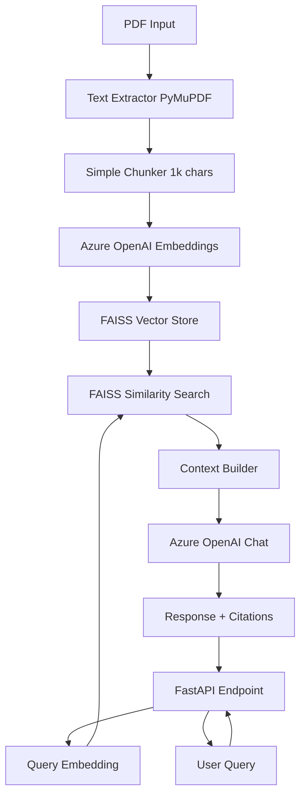
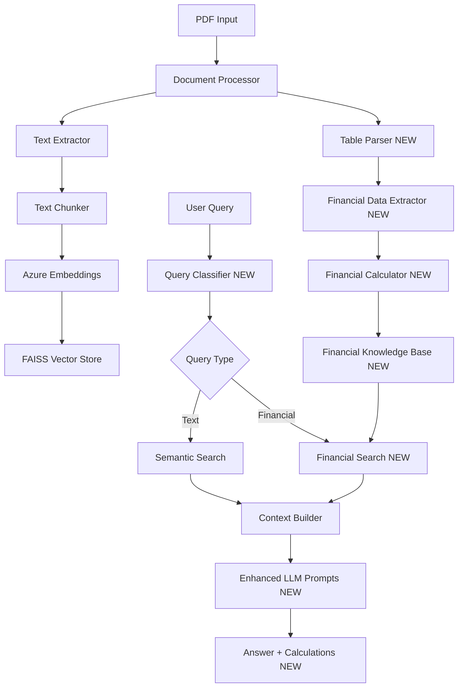
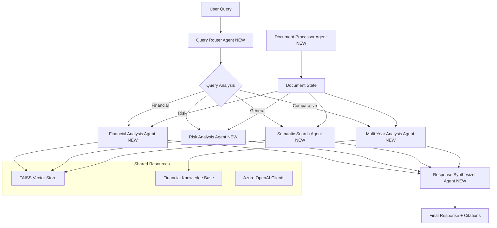
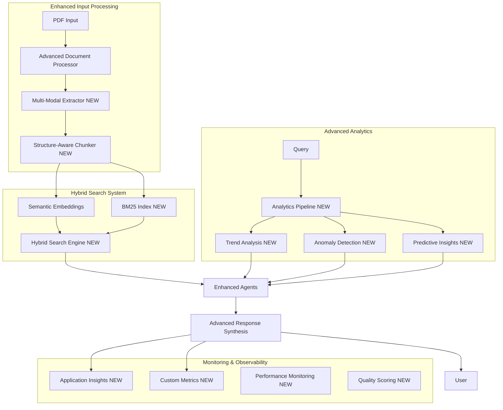
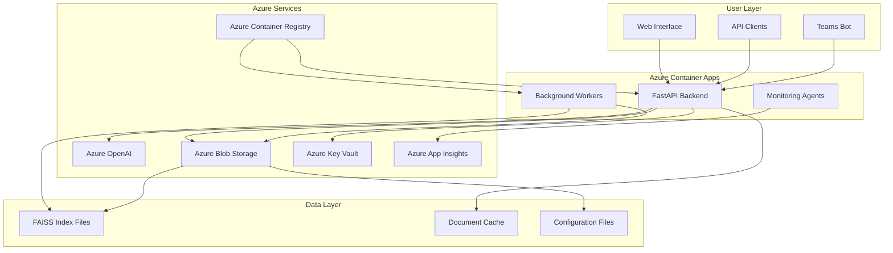

# 🗺️ **Annual Report Analyzer - Implementation Roadmap**
## **From MVP to Advanced Multi-Agent System**

A structured delivery plan that starts with a minimal viable product and progressively builds toward the advanced RAG system with financial intelligence and multi-agent orchestration.

---

## 🎯 **Overall Strategy**

**Philosophy**: Start simple, validate core functionality, then incrementally add sophisticated features. Each phase delivers working software that can be demonstrated and tested.

**Key Principles**:
- ✅ **Working software first** - Each phase produces a deployable system
- 🔄 **Iterative refinement** - Continuous improvement and validation
- 🧪 **Test-driven development** - Comprehensive testing at each stage
- 🏗️ **Modular architecture** - Components can be enhanced independently
- 📊 **Measurable progress** - Clear success criteria for each phase

---

## 📊 **Phase Overview**

| **Phase** | **Duration** | **Key Deliverables** | **Complexity** | **Value** |
|-----------|--------------|---------------------|----------------|-----------|
| **Phase 1: MVP Core** | 2-3 weeks | Basic RAG + Azure OpenAI | 🟢 Low | 🎯 Immediate |
| **Phase 2: Financial Intelligence** | 2-3 weeks | Table parsing + calculations | 🟡 Medium | 💰 High |
| **Phase 3: Multi-Agent Foundation** | 3-4 weeks | LangGraph + specialized agents | 🟠 Medium-High | 🤖 High |
| **Phase 4: Advanced Features** | 3-4 weeks | Hybrid search + monitoring | 🔴 High | 📈 Strategic |
| **Phase 5: Production Ready** | 2-3 weeks | Deployment + optimization | 🟡 Medium | 🚀 Critical |

**Total Timeline**: 12-17 weeks (3-4 months)

---

# 🚀 **Phase 1: MVP Core (2-3 weeks)**
## **Goal**: Functional basic RAG system with Azure OpenAI

### **MVP Architecture**



### **Week 1: Core Infrastructure**

#### **Day 1-2: Project Setup**
```bash
# Deliverables
├── Project structure creation
├── Virtual environment setup
├── Basic configuration system
├── Azure OpenAI client setup
└── Initial testing framework
```

**Key Tasks**:
- [ ] Create project directory structure
- [ ] Setup virtual environment and requirements.txt
- [ ] Configure Azure OpenAI credentials (Key Vault integration)
- [ ] Create basic configuration management (YAML files)
- [ ] Setup logging framework
- [ ] Create initial unit test structure

**Acceptance Criteria**:
- [ ] Azure OpenAI connection test passes
- [ ] Configuration loads correctly from YAML
- [ ] Basic logging works in all components
- [ ] Project can be run locally with `python main.py`

#### **Day 3-4: Document Processing**
```python
# src/extractors/text_extractor.py
class TextExtractor:
    """Basic PDF text extraction using PyMuPDF"""
    
    def extract_text_from_pdf(self, pdf_path: str) -> List[Page]:
        """Extract text from PDF with page-level metadata"""
        pass
    
    def clean_text(self, text: str) -> str:
        """Basic text cleaning and normalization"""
        pass
```

**Key Tasks**:
- [ ] Implement PDF text extraction with PyMuPDF
- [ ] Create basic text cleaning pipeline
- [ ] Add metadata extraction (filename, page numbers)
- [ ] Handle common PDF parsing errors
- [ ] Create text extraction tests

**Acceptance Criteria**:
- [ ] Can extract text from sample annual report PDFs
- [ ] Page-level metadata correctly preserved
- [ ] Handles corrupted/encrypted PDFs gracefully
- [ ] Text quality is readable and properly formatted

#### **Day 5: Chunking Strategy**
```python
# src/rag/chunking_strategy.py
class BasicChunkingStrategy:
    """Simple recursive chunking for MVP"""
    
    def chunk_document(self, document: str) -> List[Chunk]:
        """Split document into overlapping chunks"""
        pass
```

**Key Tasks**:
- [ ] Implement RecursiveCharacterTextSplitter integration
- [ ] Configure optimal chunk size (1000 chars) and overlap (200 chars)
- [ ] Preserve metadata through chunking process
- [ ] Add chunk deduplication logic
- [ ] Test chunking quality on financial documents

**Acceptance Criteria**:
- [ ] Chunks maintain logical coherence
- [ ] Financial statements not split mid-table
- [ ] Chunk overlap preserves context
- [ ] Metadata tracks original page/section

### **Week 2: Vector Storage & Retrieval**

#### **Day 6-7: Azure OpenAI Integration**
```python
# src/azure/embedding_client.py
class AzureEmbeddingClient:
    """Azure OpenAI embedding client with rate limiting"""
    
    async def get_embeddings(self, texts: List[str]) -> List[np.ndarray]:
        """Batch embedding generation with retry logic"""
        pass

# src/azure/chat_client.py  
class AzureChatClient:
    """Azure OpenAI chat client for answer generation"""
    
    async def generate_answer(self, context: str, query: str) -> str:
        """Generate answer from context with citations"""
        pass
```

**Key Tasks**:
- [ ] Implement Azure OpenAI embedding client
- [ ] Add rate limiting and retry logic
- [ ] Implement chat completion client
- [ ] Add error handling and fallback mechanisms
- [ ] Create Azure client integration tests

**Acceptance Criteria**:
- [ ] Embeddings generated successfully for text chunks
- [ ] Rate limiting prevents API quota violations
- [ ] Chat completions return coherent answers
- [ ] All Azure API errors handled gracefully

#### **Day 8-9: FAISS Vector Store**
```python
# src/rag/vector_store.py
class FAISSVectorStore:
    """In-memory FAISS vector store with persistence"""
    
    def add_documents(self, docs: List[Document], embeddings: List[np.ndarray]):
        """Add documents and embeddings to index"""
        pass
        
    def similarity_search(self, query_embedding: np.ndarray, k: int) -> List[Tuple[Document, float]]:
        """Semantic similarity search"""
        pass
```

**Key Tasks**:
- [ ] Implement FAISS index creation and management
- [ ] Add document-embedding synchronization
- [ ] Implement similarity search with scoring
- [ ] Add index persistence (save/load)
- [ ] Create vector store tests

**Acceptance Criteria**:
- [ ] FAISS index builds successfully from embeddings
- [ ] Similarity search returns relevant chunks
- [ ] Index can be saved and reloaded
- [ ] Search performance < 100ms for 1000+ chunks

#### **Day 10: Context Building & Answer Generation**
```python
# src/rag/context_builder.py
class ContextBuilder:
    """Assemble retrieval results into LLM context"""
    
    def build_context(self, results: List[RetrievalResult]) -> str:
        """Build context string with citations"""
        pass

# src/rag/answer_generator.py
class AnswerGenerator:
    """Generate final answers with citations"""
    
    async def generate_answer(self, context: str, query: str) -> Dict:
        """Generate answer with structured citations"""
        pass
```

**Key Tasks**:
- [ ] Implement context assembly with proper formatting
- [ ] Add citation tracking through the pipeline
- [ ] Create answer generation prompts
- [ ] Implement structured response parsing
- [ ] Test answer quality and citation accuracy

**Acceptance Criteria**:
- [ ] Context properly formatted with document references
- [ ] Citations link back to correct pages/sections
- [ ] Answers are factually grounded in provided context
- [ ] Response includes confidence indicators

### **Week 3: API & Integration**

#### **Day 11-12: FastAPI Backend**
```python
# api/fastapi_app.py
from fastapi import FastAPI, HTTPException
from pydantic import BaseModel

class QueryRequest(BaseModel):
    question: str
    document_id: str

class AnalysisResponse(BaseModel):
    answer: str
    citations: List[Citation]
    confidence: float

@app.post("/analyze", response_model=AnalysisResponse)
async def analyze_document(request: QueryRequest):
    """Main analysis endpoint"""
    pass
```

**Key Tasks**:
- [ ] Create FastAPI application structure
- [ ] Implement REST API endpoints
- [ ] Add request/response models with Pydantic
- [ ] Integrate RAG pipeline with API
- [ ] Add basic error handling and validation

**Acceptance Criteria**:
- [ ] API accepts queries and returns structured responses
- [ ] Request validation prevents malformed inputs
- [ ] Error responses provide helpful messages
- [ ] API documentation auto-generated with OpenAPI

#### **Day 13-14: End-to-End Integration**
```python
# src/orchestrator/mvp_orchestrator.py
class MVPOrchestrator:
    """Simple orchestrator for MVP workflow"""
    
    def __init__(self, config: Dict):
        self.text_extractor = TextExtractor()
        self.chunker = BasicChunkingStrategy()
        self.embedding_client = AzureEmbeddingClient(config)
        self.vector_store = FAISSVectorStore()
        self.chat_client = AzureChatClient(config)
    
    async def process_document(self, pdf_path: str) -> str:
        """Process PDF and build vector index"""
        pass
        
    async def query_document(self, query: str) -> Dict:
        """Query processed document"""
        pass
```

**Key Tasks**:
- [ ] Create end-to-end orchestrator
- [ ] Implement document processing pipeline
- [ ] Add query processing workflow
- [ ] Create integration tests
- [ ] Performance testing and optimization

**Acceptance Criteria**:
- [ ] Complete document processing works end-to-end
- [ ] Queries return relevant, accurate answers
- [ ] System processes typical annual report (50-100 pages) in < 5 minutes
- [ ] Query response time < 3 seconds

#### **Day 15: MVP Testing & Demo**

**Key Tasks**:
- [ ] Comprehensive testing with real annual reports
- [ ] Performance benchmarking
- [ ] User acceptance testing
- [ ] Demo preparation
- [ ] Documentation completion

**MVP Demo Scenarios**:
1. **Revenue Query**: "What was the total revenue in 2024?"
2. **Growth Analysis**: "How did revenue grow compared to 2023?"
3. **Risk Factors**: "What are the main risk factors mentioned?"
4. **Citation Verification**: Verify all answers link to correct pages

**Success Criteria**:
- [ ] All demo scenarios work consistently
- [ ] Citations are accurate for 95%+ of answers
- [ ] System handles 3 different annual report formats
- [ ] Performance meets targets (processing + query times)

---

# 💰 **Phase 2: Financial Intelligence (2-3 weeks)**
## **Goal**: Add table parsing and financial calculation capabilities

### **Enhanced Architecture**



### **Week 4: Table Parsing Foundation**

#### **Day 16-17: Table Detection & Extraction**
```python
# src/extractors/table_parser.py
import pdfplumber
import camelot
import pandas as pd

class TableParser:
    """Advanced table parsing for financial documents"""
    
    def detect_tables(self, pdf_path: str) -> List[TableInfo]:
        """Detect tables in PDF pages"""
        pass
        
    def extract_table_data(self, table_info: TableInfo) -> pd.DataFrame:
        """Extract structured data from tables"""
        pass
        
    def identify_financial_tables(self, tables: List[pd.DataFrame]) -> List[FinancialTable]:
        """Classify tables as income statement, balance sheet, etc."""
        pass
```

**Key Tasks**:
- [ ] Implement multi-engine table detection (pdfplumber + camelot)
- [ ] Create table classification logic (income statement, balance sheet)
- [ ] Add table data cleaning and normalization
- [ ] Handle merged cells and complex layouts
- [ ] Create table extraction tests

**Acceptance Criteria**:
- [ ] Accurately detects 90%+ of financial tables
- [ ] Correctly classifies major financial statement types
- [ ] Preserves numeric data precision
- [ ] Handles common annual report table formats

#### **Day 18-19: Financial Data Normalization**
```python
# src/extractors/financial_normalizer.py
class FinancialDataNormalizer:
    """Normalize financial data across different formats"""
    
    def normalize_currency(self, value: str) -> float:
        """Convert currency strings to float values"""
        pass
        
    def detect_units(self, table: pd.DataFrame) -> str:
        """Detect if values are in thousands, millions, etc."""
        pass
        
    def standardize_line_items(self, table: pd.DataFrame) -> pd.DataFrame:
        """Map various revenue/expense names to standard terms"""
        pass
```

**Key Tasks**:
- [ ] Implement currency string parsing (handle $, millions, etc.)
- [ ] Create unit detection (thousands, millions, billions)
- [ ] Build financial terminology mapping
- [ ] Add data validation rules
- [ ] Create normalization tests

**Acceptance Criteria**:
- [ ] Currency values parsed with 99%+ accuracy
- [ ] Units correctly detected and converted
- [ ] Standard financial terms consistently mapped
- [ ] Invalid/corrupted data flagged appropriately

### **Week 5: Financial Calculations**

#### **Day 20-21: Core Financial Calculator**
```python
# src/financial/calculator.py
class FinancialCalculator:
    """Automated financial ratio and growth calculations"""
    
    def calculate_yoy_growth(self, current: float, previous: float) -> GrowthMetrics:
        """Calculate year-over-year growth with context"""
        pass
        
    def calculate_financial_ratios(self, financial_data: FinancialData) -> RatioAnalysis:
        """Calculate standard financial ratios"""
        pass
        
    def validate_calculations(self, calculations: Dict) -> ValidationResult:
        """Validate calculations for reasonableness"""
        pass
```

**Key Tasks**:
- [ ] Implement YoY growth calculations
- [ ] Add profitability ratio calculations (ROE, ROA, margins)
- [ ] Create liquidity ratio calculations (current, quick ratios)
- [ ] Add leverage ratio calculations (debt-to-equity, etc.)
- [ ] Implement calculation validation logic

**Acceptance Criteria**:
- [ ] Calculations match manually computed values
- [ ] Handles edge cases (zero denominators, negative values)
- [ ] Provides confidence scores for calculations
- [ ] Flags unreasonable results for review

#### **Day 22-23: Multi-Year Comparison**
```python
# src/financial/comparator.py
class MultiYearComparator:
    """Compare financial metrics across multiple periods"""
    
    def compare_financial_statements(self, statements: List[FinancialStatement]) -> ComparisonAnalysis:
        """Compare statements across years"""
        pass
        
    def identify_trends(self, metrics: Dict[str, List[float]]) -> TrendAnalysis:
        """Identify significant trends in financial data"""
        pass
        
    def flag_anomalies(self, comparisons: ComparisonAnalysis) -> List[Anomaly]:
        """Flag unusual changes or values"""
        pass
```

**Key Tasks**:
- [ ] Implement cross-period comparison logic
- [ ] Add trend identification algorithms
- [ ] Create anomaly detection for unusual changes
- [ ] Build comparison visualization data
- [ ] Add multi-year validation tests

**Acceptance Criteria**:
- [ ] Accurately compares metrics across 3+ years
- [ ] Identifies significant trends (>20% changes)
- [ ] Flags genuine anomalies without false positives
- [ ] Provides clear explanations for identified trends

### **Week 6: Enhanced Query Processing**

#### **Day 24-25: Financial Query Classification**
```python
# src/rag/query_classifier.py
class QueryClassifier:
    """Classify queries to route to appropriate processing"""
    
    def classify_query(self, query: str) -> QueryType:
        """Determine if query is financial, textual, or comparative"""
        pass
        
    def extract_financial_entities(self, query: str) -> FinancialEntities:
        """Extract metrics, years, companies mentioned"""
        pass
        
    def generate_search_strategy(self, query_type: QueryType, entities: FinancialEntities) -> SearchStrategy:
        """Generate appropriate search strategy"""
        pass
```

**Key Tasks**:
- [ ] Implement query type classification
- [ ] Add financial entity extraction (NER)
- [ ] Create search strategy generation
- [ ] Add query expansion for financial terms
- [ ] Test classification accuracy

**Acceptance Criteria**:
- [ ] 95%+ accuracy in query type classification
- [ ] Correctly extracts financial metrics and years
- [ ] Routes queries to appropriate processing pipelines
- [ ] Handles ambiguous queries gracefully

#### **Day 26-27: Enhanced Context Building**
```python
# src/rag/enhanced_context_builder.py
class EnhancedContextBuilder:
    """Build context with financial data integration"""
    
    def build_financial_context(self, query: str, text_results: List, calc_results: Dict) -> str:
        """Combine text and calculation results"""
        pass
        
    def format_financial_data(self, calculations: Dict) -> str:
        """Format calculations for LLM consumption"""
        pass
        
    def validate_context_coherence(self, context: str) -> bool:
        """Ensure context is coherent and complete"""
        pass
```

**Key Tasks**:
- [ ] Enhance context builder to include financial calculations
- [ ] Create templates for financial data presentation
- [ ] Add context validation and coherence checking
- [ ] Implement context length optimization
- [ ] Test context quality with financial queries

**Acceptance Criteria**:
- [ ] Context includes relevant financial calculations
- [ ] Financial data properly formatted for LLM understanding
- [ ] Context maintains narrative coherence
- [ ] Stays within LLM token limits

#### **Day 28: Integration & Testing**

**Key Tasks**:
- [ ] Integrate all Phase 2 components
- [ ] Comprehensive testing with financial queries
- [ ] Performance optimization for table processing
- [ ] User acceptance testing
- [ ] Documentation updates

**Phase 2 Demo Scenarios**:
1. **Ratio Analysis**: "What was the ROE in 2024 and how does it compare to 2023?"
2. **Growth Calculation**: "Calculate the revenue growth rate over the past 3 years"
3. **Table Data**: "What were the total assets and liabilities in 2024?"
4. **Trend Analysis**: "How has the gross margin trended over the past 5 years?"

**Success Criteria**:
- [ ] All financial calculations are accurate
- [ ] Table data extraction works for major statement types
- [ ] Multi-year comparisons provide meaningful insights
- [ ] Processing time increase < 50% from MVP

---

# 🤖 **Phase 3: Multi-Agent Foundation (3-4 weeks)**
## **Goal**: Implement LangGraph orchestration with specialized agents

### **Multi-Agent Architecture**



### **Week 7-8: LangGraph Foundation**

#### **Day 29-30: State Management System**
```python
# src/orchestrator/state_manager.py
from typing_extensions import TypedDict
from langgraph import StateGraph

class AnalysisState(TypedDict):
    """Shared state across all agents"""
    query: str
    document_path: str
    processed_chunks: List[Document]
    retrieval_results: List[RetrievalResult]
    financial_calculations: Dict[str, Any]
    risk_analysis: Dict[str, Any]
    semantic_results: List[SemanticResult]
    final_answer: str
    citations: List[Citation]
    confidence_score: float
    agent_trace: List[AgentAction]
```

**Key Tasks**:
- [ ] Design comprehensive state schema
- [ ] Implement state persistence across agent calls
- [ ] Add state validation and error handling
- [ ] Create state transition logging
- [ ] Build state management tests

**Acceptance Criteria**:
- [ ] State correctly shared across all agents
- [ ] State transitions properly logged for debugging
- [ ] Invalid state changes rejected appropriately
- [ ] State can be serialized for debugging/auditing

#### **Day 31-32: Document Processor Agent**
```python
# src/agents/document_processor.py
from langgraph import BaseAgent

class DocumentProcessorAgent(BaseAgent):
    """Handles PDF processing and initial analysis"""
    
    async def process_document(self, state: AnalysisState) -> AnalysisState:
        """Process document and update state"""
        pass
        
    async def detect_document_sections(self, pdf_path: str) -> List[DocumentSection]:
        """Identify different sections of annual report"""
        pass
        
    async def extract_metadata(self, pdf_path: str) -> DocumentMetadata:
        """Extract company, year, document type metadata"""
        pass
```

**Key Tasks**:
- [ ] Implement document processing agent
- [ ] Add section detection (10-K sections, exhibits)
- [ ] Create metadata extraction
- [ ] Add document quality assessment
- [ ] Build processing agent tests

**Acceptance Criteria**:
- [ ] Successfully processes various annual report formats
- [ ] Correctly identifies major document sections
- [ ] Extracts accurate metadata (company, year, type)
- [ ] Handles processing errors gracefully

#### **Day 33-34: Query Router Agent**
```python
# src/agents/query_router.py
class QueryRouterAgent(BaseAgent):
    """Routes queries to appropriate specialist agents"""
    
    async def route_query(self, state: AnalysisState) -> AnalysisState:
        """Analyze query and determine routing strategy"""
        pass
        
    async def classify_query_intent(self, query: str) -> QueryIntent:
        """Classify query intent and complexity"""
        pass
        
    async def plan_execution(self, query_intent: QueryIntent) -> ExecutionPlan:
        """Create execution plan for multi-agent coordination"""
        pass
```

**Key Tasks**:
- [ ] Implement intelligent query routing logic
- [ ] Create query intent classification
- [ ] Add execution planning for complex queries
- [ ] Build routing decision tree
- [ ] Test routing accuracy

**Acceptance Criteria**:
- [ ] 95%+ accuracy in query classification
- [ ] Routes complex queries to multiple appropriate agents
- [ ] Creates sensible execution plans
- [ ] Handles ambiguous queries effectively

#### **Day 35: Core Agent Framework**
```python
# src/agents/base_agent.py
class BaseFinancialAgent(BaseAgent):
    """Base class for all financial analysis agents"""
    
    def __init__(self, name: str, capabilities: List[str], tools: List[Tool]):
        super().__init__(name)
        self.capabilities = capabilities
        self.tools = tools
        
    async def execute(self, state: AnalysisState) -> AnalysisState:
        """Execute agent-specific logic"""
        pass
        
    async def validate_inputs(self, state: AnalysisState) -> bool:
        """Validate inputs before execution"""
        pass
        
    async def log_execution(self, state: AnalysisState, result: AgentResult):
        """Log agent execution for debugging"""
        pass
```

**Key Tasks**:
- [ ] Create base agent class with common functionality
- [ ] Implement agent capability registry
- [ ] Add execution logging and monitoring
- [ ] Create agent testing framework
- [ ] Build agent coordination protocols

### **Week 9: Specialized Agents**

#### **Day 36-37: Financial Analysis Agent**
```python
# src/agents/financial_analyzer.py
class FinancialAnalysisAgent(BaseFinancialAgent):
    """Specialized agent for financial calculations and analysis"""
    
    async def analyze_financial_metrics(self, state: AnalysisState) -> FinancialAnalysis:
        """Perform comprehensive financial analysis"""
        pass
        
    async def calculate_requested_ratios(self, query: str, financial_data: Dict) -> RatioResults:
        """Calculate specific ratios mentioned in query"""
        pass
        
    async def validate_financial_logic(self, calculations: Dict) -> ValidationReport:
        """Validate financial calculations for reasonableness"""
        pass
```

**Key Tasks**:
- [ ] Implement financial analysis agent
- [ ] Add comprehensive ratio calculation suite
- [ ] Create financial data validation
- [ ] Build domain-specific prompts
- [ ] Test financial accuracy

#### **Day 38-39: Risk Analysis Agent**
```python
# src/agents/risk_analyzer.py  
class RiskAnalysisAgent(BaseFinancialAgent):
    """Specialized agent for risk factor identification and analysis"""
    
    async def identify_risk_factors(self, state: AnalysisState) -> List[RiskFactor]:
        """Identify and categorize risk factors"""
        pass
        
    async def assess_risk_severity(self, risk_factors: List[RiskFactor]) -> RiskAssessment:
        """Assess the severity and impact of identified risks"""
        pass
        
    async def compare_risk_profiles(self, current_risks: List[RiskFactor], historical_risks: List[RiskFactor]) -> RiskComparison:
        """Compare current risks to historical patterns"""
        pass
```

**Key Tasks**:
- [ ] Implement risk identification algorithms
- [ ] Create risk categorization system
- [ ] Add risk severity assessment
- [ ] Build risk comparison logic
- [ ] Test risk analysis accuracy

#### **Day 40: Semantic Search Agent**
```python
# src/agents/semantic_searcher.py
class SemanticSearchAgent(BaseFinancialAgent):
    """Enhanced semantic search with financial domain knowledge"""
    
    async def enhanced_semantic_search(self, state: AnalysisState) -> List[SemanticResult]:
        """Perform domain-aware semantic search"""
        pass
        
    async def expand_financial_queries(self, query: str) -> List[str]:
        """Expand queries with financial synonyms and related terms"""
        pass
        
    async def rerank_results(self, results: List[RetrievalResult], query: str) -> List[RetrievalResult]:
        """Rerank results based on financial relevance"""
        pass
```

**Key Tasks**:
- [ ] Enhance semantic search with financial domain knowledge
- [ ] Implement query expansion for financial terms
- [ ] Add result reranking based on relevance
- [ ] Create financial terminology mappings
- [ ] Test search quality improvements

### **Week 10: Agent Orchestration**

#### **Day 41-42: LangGraph Workflow Engine**
```python
# src/orchestrator/workflow_graph.py
from langgraph import StateGraph, CompiledGraph

class FinancialAnalysisWorkflow:
    """LangGraph orchestrator for multi-agent financial analysis"""
    
    def __init__(self, agents: Dict[str, BaseFinancialAgent], config: Dict):
        self.agents = agents
        self.workflow = self._build_workflow()
        
    def _build_workflow(self) -> CompiledGraph:
        """Define the agent coordination workflow"""
        workflow = StateGraph(AnalysisState)
        
        # Add agent nodes
        workflow.add_node("document_processor", self._process_document)
        workflow.add_node("query_router", self._route_query)
        workflow.add_node("financial_analyzer", self._financial_analysis)
        workflow.add_node("risk_analyzer", self._risk_analysis)
        workflow.add_node("semantic_searcher", self._semantic_search)
        workflow.add_node("response_synthesizer", self._synthesize_response)
        
        # Define conditional routing
        workflow.add_conditional_edges(
            "query_router",
            self._route_decision,
            {
                "financial": "financial_analyzer",
                "risk": "risk_analyzer",
                "semantic": "semantic_searcher",
                "multi_agent": ["financial_analyzer", "semantic_searcher"]
            }
        )
        
        return workflow.compile()
```

**Key Tasks**:
- [ ] Build comprehensive LangGraph workflow
- [ ] Implement conditional routing logic
- [ ] Add parallel agent execution
- [ ] Create workflow visualization
- [ ] Test workflow execution paths

#### **Day 43-44: Response Synthesizer Agent**
```python
# src/agents/response_synthesizer.py
class ResponseSynthesizerAgent(BaseFinancialAgent):
    """Synthesizes multi-agent outputs into coherent final responses"""
    
    async def synthesize_response(self, state: AnalysisState) -> FinalResponse:
        """Combine outputs from multiple agents"""
        pass
        
    async def resolve_conflicts(self, agent_results: Dict[str, AgentResult]) -> ConflictResolution:
        """Resolve conflicting information from different agents"""
        pass
        
    async def format_final_answer(self, synthesis: ResponseSynthesis) -> str:
        """Format final answer with proper citations and structure"""
        pass
```

**Key Tasks**:
- [ ] Implement multi-agent result synthesis
- [ ] Add conflict resolution logic
- [ ] Create coherent response formatting
- [ ] Build confidence scoring system
- [ ] Test synthesis quality

#### **Day 45: Integration & Testing**

**Key Tasks**:
- [ ] Complete multi-agent workflow integration
- [ ] End-to-end testing with complex queries
- [ ] Performance optimization for agent coordination
- [ ] Agent interaction debugging
- [ ] Documentation of agent capabilities

**Phase 3 Demo Scenarios**:
1. **Complex Financial Query**: "Analyze the company's profitability trends and identify key risk factors affecting future performance"
2. **Multi-Domain Analysis**: "Compare revenue growth to industry peers and assess competitive risks"
3. **Comprehensive Review**: "Provide a complete financial health assessment including ratios, trends, and risk analysis"

**Success Criteria**:
- [ ] Multi-agent workflows execute reliably
- [ ] Complex queries handled by appropriate agent combinations
- [ ] Agent coordination adds value over single-agent responses
- [ ] Response quality measurably improved

---

# 📈 **Phase 4: Advanced Features (3-4 weeks)**
## **Goal**: Add hybrid search, monitoring, and advanced analytics

### **Advanced System Architecture**



### **Week 11: Hybrid Search Implementation**

#### **Day 46-47: BM25 Integration**
```python
# src/rag/hybrid_search.py
from rank_bm25 import BM25Okapi
import numpy as np

class HybridSearchEngine:
    """Combines semantic and lexical search for optimal retrieval"""
    
    def __init__(self, vector_store: FAISSVectorStore, semantic_weight: float = 0.7):
        self.vector_store = vector_store
        self.semantic_weight = semantic_weight
        self.lexical_weight = 1.0 - semantic_weight
        self.bm25_index = None
        
    def build_bm25_index(self, documents: List[Document]):
        """Build BM25 index for lexical search"""
        pass
        
    def hybrid_search(self, query: str, k: int = 10) -> List[HybridResult]:
        """Perform hybrid semantic + lexical search"""
        pass
        
    def fuse_scores(self, semantic_results: List, bm25_results: List) -> List[HybridResult]:
        """Fuse semantic and BM25 scores using RRF (Reciprocal Rank Fusion)"""
        pass
```

**Key Tasks**:
- [ ] Integrate BM25 for lexical search
- [ ] Implement score fusion algorithms (RRF, weighted combination)
- [ ] Add query preprocessing for both search types
- [ ] Optimize search performance
- [ ] Test hybrid search quality

**Acceptance Criteria**:
- [ ] Hybrid search outperforms semantic-only on evaluation set
- [ ] Handles both conceptual and exact-match queries well
- [ ] Search performance remains < 200ms
- [ ] Score fusion produces sensible rankings

#### **Day 48-49: Advanced Query Processing**
```python
# src/rag/query_processor.py
class AdvancedQueryProcessor:
    """Advanced query understanding and expansion"""
    
    def analyze_query_complexity(self, query: str) -> QueryComplexity:
        """Determine query complexity and processing requirements"""
        pass
        
    def expand_query(self, query: str, domain: str = "financial") -> List[str]:
        """Expand query with domain-specific terms and synonyms"""
        pass
        
    def decompose_complex_query(self, query: str) -> List[SubQuery]:
        """Break complex queries into manageable sub-queries"""
        pass
```

**Key Tasks**:
- [ ] Implement query complexity analysis
- [ ] Add domain-specific query expansion
- [ ] Create complex query decomposition
- [ ] Build query optimization strategies
- [ ] Test query processing improvements

### **Week 12: Advanced Analytics**

#### **Day 50-51: Trend Analysis Engine**
```python
# src/analytics/trend_analyzer.py
import pandas as pd
import numpy as np
from scipy import stats

class TrendAnalyzer:
    """Advanced trend detection and analysis for financial data"""
    
    def detect_trends(self, time_series: pd.Series) -> TrendAnalysis:
        """Detect trends using statistical methods"""
        pass
        
    def forecast_trends(self, historical_data: pd.DataFrame) -> ForecastResult:
        """Simple trend forecasting using statistical methods"""
        pass
        
    def identify_inflection_points(self, data: pd.Series) -> List[InflectionPoint]:
        """Identify significant changes in trends"""
        pass
```

**Key Tasks**:
- [ ] Implement statistical trend detection
- [ ] Add simple forecasting capabilities
- [ ] Create inflection point identification
- [ ] Build trend visualization data
- [ ] Test trend analysis accuracy

#### **Day 52-53: Anomaly Detection**
```python
# src/analytics/anomaly_detector.py
class AnomalyDetector:
    """Detect anomalies in financial data and responses"""
    
    def detect_financial_anomalies(self, financial_data: Dict) -> List[Anomaly]:
        """Detect unusual patterns in financial metrics"""
        pass
        
    def validate_response_quality(self, response: str, context: str) -> QualityScore:
        """Detect anomalies in generated responses"""
        pass
        
    def flag_inconsistencies(self, multi_year_data: List[Dict]) -> List[Inconsistency]:
        """Flag inconsistencies across time periods"""
        pass
```

**Key Tasks**:
- [ ] Implement financial data anomaly detection
- [ ] Add response quality validation
- [ ] Create inconsistency detection
- [ ] Build anomaly scoring system
- [ ] Test anomaly detection accuracy

### **Week 13: Monitoring & Observability**

#### **Day 54-55: Application Monitoring**
```python
# src/utils/monitoring.py
from azure.monitor.applicationinsights import ApplicationInsightsDataClient
import time
from functools import wraps

class PerformanceMonitor:
    """Comprehensive performance and quality monitoring"""
    
    def __init__(self, app_insights_key: str):
        self.client = ApplicationInsightsDataClient(app_insights_key)
        
    def track_query_performance(self, query: str, response_time: float, quality_score: float):
        """Track query processing metrics"""
        pass
        
    def monitor_agent_performance(self, agent_name: str, execution_time: float, success: bool):
        """Monitor individual agent performance"""
        pass
        
    def track_quality_metrics(self, response: str, expected_citations: int, actual_citations: int):
        """Track response quality metrics"""
        pass

def monitor_execution(monitor: PerformanceMonitor, metric_name: str):
    """Decorator to monitor function execution"""
    def decorator(func):
        @wraps(func)
        async def wrapper(*args, **kwargs):
            start_time = time.time()
            try:
                result = await func(*args, **kwargs)
                execution_time = time.time() - start_time
                monitor.track_metric(f"{metric_name}_success", execution_time)
                return result
            except Exception as e:
                execution_time = time.time() - start_time
                monitor.track_metric(f"{metric_name}_error", execution_time)
                raise
        return wrapper
    return decorator
```

**Key Tasks**:
- [ ] Implement comprehensive performance monitoring
- [ ] Add Azure Application Insights integration
- [ ] Create custom metrics for financial analysis quality
- [ ] Build monitoring dashboards
- [ ] Set up alerting for performance issues

#### **Day 56-57: Quality Assessment**
```python
# src/evaluation/quality_assessor.py
class QualityAssessor:
    """Automated quality assessment for responses"""
    
    def assess_response_quality(self, response: str, context: str, query: str) -> QualityReport:
        """Comprehensive response quality assessment"""
        pass
        
    def validate_citations(self, response: str, citations: List[Citation], source_docs: List[Document]) -> CitationValidation:
        """Validate citation accuracy and completeness"""
        pass
        
    def score_financial_accuracy(self, response: str, ground_truth: Dict) -> AccuracyScore:
        """Score accuracy of financial calculations and statements"""
        pass
```

**Key Tasks**:
- [ ] Implement automated quality assessment
- [ ] Create citation validation system
- [ ] Build financial accuracy scoring
- [ ] Add quality reporting dashboards
- [ ] Test quality assessment reliability

### **Week 14: Advanced Features Integration**

#### **Day 58-59: Feature Integration**

**Key Tasks**:
- [ ] Integrate hybrid search into agent workflows
- [ ] Add advanced analytics to response synthesis
- [ ] Enable monitoring across all components
- [ ] Optimize performance with new features
- [ ] Comprehensive integration testing

#### **Day 60: Phase 4 Testing & Optimization**

**Phase 4 Demo Scenarios**:
1. **Hybrid Search**: "Find all mentions of supply chain risks and calculate their potential financial impact"
2. **Trend Analysis**: "Analyze the 5-year trend in operating margins and predict next year's performance"
3. **Quality Monitoring**: Demonstrate real-time quality metrics and performance dashboards
4. **Anomaly Detection**: Show how the system flags unusual financial data or inconsistent responses

**Success Criteria**:
- [ ] Hybrid search improves retrieval quality by 20%+ over semantic-only
- [ ] Trend analysis provides actionable insights
- [ ] Monitoring captures all critical performance and quality metrics
- [ ] System maintains performance with advanced features

---

# 🚀 **Phase 5: Production Ready (2-3 weeks)**
## **Goal**: Deploy to Azure with full production capabilities

### **Production Architecture**



### **Week 15: Infrastructure & Deployment**

#### **Day 61-62: Azure Infrastructure**
```bicep
// deployment/infra/main.bicep
param location string = resourceGroup().location
param appName string
param openaiEndpoint string

// Azure Container Apps Environment
resource containerAppsEnvironment 'Microsoft.App/managedEnvironments@2022-03-01' = {
  name: '${appName}-env'
  location: location
  properties: {
    daprAIInstrumentationKey: applicationInsights.properties.InstrumentationKey
  }
}

// Container App for API
resource containerApp 'Microsoft.App/containerApps@2022-03-01' = {
  name: '${appName}-api'
  location: location
  properties: {
    managedEnvironmentId: containerAppsEnvironment.id
    configuration: {
      secrets: [
        {
          name: 'openai-key'
          keyVaultUrl: '${keyVault.properties.vaultUri}secrets/openai-key'
          identity: managedIdentity.id
        }
      ]
      ingress: {
        external: true
        targetPort: 8000
        traffic: [
          {
            weight: 100
            latestRevision: true
          }
        ]
      }
    }
    template: {
      containers: [
        {
          name: 'api'
          image: '${containerRegistry.properties.loginServer}/${appName}:latest'
          resources: {
            cpu: '2.0'
            memory: '4Gi'
          }
          env: [
            {
              name: 'AZURE_OPENAI_ENDPOINT'
              value: openaiEndpoint
            }
            {
              name: 'AZURE_OPENAI_KEY'
              secretRef: 'openai-key'
            }
          ]
        }
      ]
      scale: {
        minReplicas: 1
        maxReplicas: 10
      }
    }
  }
}

// Additional resources: Key Vault, Storage, Application Insights, etc.
```

**Key Tasks**:
- [ ] Create comprehensive Bicep infrastructure templates
- [ ] Set up Azure Container Apps with auto-scaling
- [ ] Configure Azure Key Vault for secrets management
- [ ] Set up Azure Blob Storage for documents and cache
- [ ] Configure Application Insights for monitoring

#### **Day 63-64: Containerization**
```dockerfile
# deployment/docker/Dockerfile
FROM python:3.11-slim

# Install system dependencies
RUN apt-get update && apt-get install -y \
    libgl1-mesa-glx \
    libglib2.0-0 \
    libgomp1 \
    && rm -rf /var/lib/apt/lists/*

WORKDIR /app

# Install Python dependencies
COPY requirements.txt .
RUN pip install --no-cache-dir -r requirements.txt

# Copy application code
COPY src/ ./src/
COPY config/ ./config/

# Create non-root user
RUN useradd -m -u 1000 appuser && chown -R appuser:appuser /app
USER appuser

# Health check
HEALTHCHECK --interval=30s --timeout=30s --start-period=5s --retries=3 \
  CMD curl -f http://localhost:8000/health || exit 1

EXPOSE 8000

CMD ["uvicorn", "src.api.fastapi_app:app", "--host", "0.0.0.0", "--port", "8000"]
```

**Key Tasks**:
- [ ] Optimize Docker image for production
- [ ] Implement proper health checks
- [ ] Set up multi-stage builds for efficiency
- [ ] Configure proper security (non-root user, minimal attack surface)
- [ ] Test containerized deployment

### **Week 16: Production Features**

#### **Day 65-66: Authentication & Security**
```python
# src/api/security.py
from fastapi import Depends, HTTPException, Security
from fastapi.security import HTTPBearer, HTTPAuthorizationCredentials
from azure.identity import DefaultAzureCredential
import jwt

class AzureADAuth:
    """Azure AD authentication for API endpoints"""
    
    def __init__(self, tenant_id: str, client_id: str):
        self.tenant_id = tenant_id
        self.client_id = client_id
        self.credential = DefaultAzureCredential()
        
    async def verify_token(self, token: str) -> Dict[str, Any]:
        """Verify Azure AD JWT token"""
        pass
        
    async def get_current_user(self, credentials: HTTPAuthorizationCredentials = Security(HTTPBearer())) -> User:
        """Extract user information from verified token"""
        pass

# Updated FastAPI app with authentication
from fastapi import FastAPI, Depends

app = FastAPI(title="Annual Report Analyzer")
auth = AzureADAuth(tenant_id=config.TENANT_ID, client_id=config.CLIENT_ID)

@app.post("/analyze")
async def analyze_document(
    request: AnalysisRequest,
    current_user: User = Depends(auth.get_current_user)
):
    """Analyze document with user authentication"""
    pass
```

**Key Tasks**:
- [ ] Implement Azure AD authentication
- [ ] Add role-based access control (RBAC)
- [ ] Set up API rate limiting
- [ ] Implement request validation and sanitization
- [ ] Add audit logging for security events

#### **Day 67-68: Caching & Performance**
```python
# src/utils/cache_manager.py
import redis
from azure.storage.blob import BlobServiceClient
import pickle
import hashlib

class CacheManager:
    """Multi-tier caching for performance optimization"""
    
    def __init__(self, redis_connection_string: str, blob_service_client: BlobServiceClient):
        self.redis_client = redis.from_url(redis_connection_string)
        self.blob_client = blob_service_client
        
    async def get_embeddings_cache(self, document_hash: str) -> Optional[List[np.ndarray]]:
        """Get cached embeddings for document"""
        pass
        
    async def cache_embeddings(self, document_hash: str, embeddings: List[np.ndarray]):
        """Cache embeddings with TTL"""
        pass
        
    async def get_analysis_cache(self, query_hash: str) -> Optional[AnalysisResult]:
        """Get cached analysis result"""
        pass
        
    async def cache_analysis(self, query_hash: str, result: AnalysisResult, ttl: int = 3600):
        """Cache analysis result"""
        pass
```

**Key Tasks**:
- [ ] Implement Redis caching for embeddings and results
- [ ] Add blob storage caching for processed documents
- [ ] Set up intelligent cache invalidation
- [ ] Implement cache warming strategies
- [ ] Monitor cache hit rates and effectiveness

### **Week 17: Final Integration & Testing**

#### **Day 69-70: End-to-End Testing**

**Key Tasks**:
- [ ] Comprehensive end-to-end testing in production environment
- [ ] Load testing with realistic user patterns
- [ ] Security penetration testing
- [ ] Disaster recovery testing
- [ ] User acceptance testing with business stakeholders

**Production Testing Scenarios**:
1. **High Load**: 100 concurrent users analyzing different documents
2. **Complex Queries**: Multi-part financial analysis queries
3. **Error Handling**: Network failures, API rate limits, invalid documents
4. **Security Testing**: Authentication, authorization, input validation
5. **Performance Testing**: Response times under various loads

#### **Day 71: Production Deployment & Launch**

**Key Tasks**:
- [ ] Production deployment using Bicep templates
- [ ] DNS setup and SSL certificate configuration
- [ ] Monitoring and alerting configuration
- [ ] User training and documentation
- [ ] Go-live support and monitoring

**Success Criteria**:
- [ ] System handles production load (50+ concurrent users)
- [ ] 99.9% uptime during first week
- [ ] Average query response time < 3 seconds
- [ ] All security requirements met
- [ ] User satisfaction > 85% in initial feedback

---

## 📊 **Success Metrics & KPIs**

### **Technical Metrics**

| **Metric** | **MVP Target** | **Phase 2** | **Phase 3** | **Production** |
|------------|----------------|-------------|--------------|----------------|
| **Query Response Time** | < 5s | < 4s | < 3s | < 2s |
| **Document Processing Time** | < 10 min | < 8 min | < 6 min | < 5 min |
| **Answer Accuracy** | 80% | 85% | 90% | 95% |
| **Citation Accuracy** | 90% | 95% | 97% | 99% |
| **System Uptime** | 95% | 98% | 99% | 99.9% |
| **Concurrent Users** | 5 | 20 | 50 | 100+ |

### **Business Value Metrics**

| **Metric** | **Baseline** | **Phase 2** | **Phase 3** | **Production** |
|------------|--------------|-------------|--------------|----------------|
| **Analysis Time Reduction** | Manual: 2-4 hours | 30 min | 15 min | 5 min |
| **Financial Accuracy** | Human: 95% | 90% | 95% | 98% |
| **Coverage of Annual Report** | 60% | 80% | 90% | 95% |
| **Query Types Supported** | 5 basic | 15 financial | 25+ complex | 50+ comprehensive |

---

## 🚨 **Risk Mitigation**

### **Technical Risks**

1. **Azure OpenAI Rate Limits**
   - **Mitigation**: Implement proper rate limiting, caching, and fallback strategies
   - **Contingency**: Multi-region deployment, alternative model providers

2. **FAISS Performance with Large Documents**
   - **Mitigation**: Optimize chunking, implement hierarchical indexing
   - **Contingency**: Migration path to Azure AI Search

3. **LangGraph Complexity**
   - **Mitigation**: Incremental implementation, comprehensive testing
   - **Contingency**: Fallback to simpler orchestration patterns

### **Business Risks**

1. **User Adoption**
   - **Mitigation**: Early user involvement, iterative feedback integration
   - **Contingency**: Simplified UI, extensive training materials

2. **Accuracy Requirements**
   - **Mitigation**: Extensive testing, human validation workflows
   - **Contingency**: Confidence scoring, manual review processes

---

## 🎯 **Next Steps**

**Immediate Actions (Next Week)**:
1. [ ] Confirm Azure OpenAI resource setup
2. [ ] Set up development environment
3. [ ] Create project repository and basic structure
4. [ ] Begin Phase 1 Day 1 tasks

**Decision Points**:
1. **After MVP (Phase 1)**: Validate core functionality meets requirements
2. **After Phase 2**: Assess financial intelligence value and accuracy
3. **After Phase 3**: Evaluate multi-agent complexity vs. value
4. **Before Production**: Confirm security and scalability requirements

**Key Stakeholder Checkpoints**:
- **Week 3**: MVP Demo and feedback
- **Week 6**: Financial features demonstration
- **Week 10**: Multi-agent capabilities review
- **Week 14**: Production readiness assessment
- **Week 17**: Go-live decision

This roadmap provides a clear path from a simple MVP to a sophisticated, production-ready annual report analysis system. Each phase builds incrementally while delivering working software that can be tested and validated by users.
