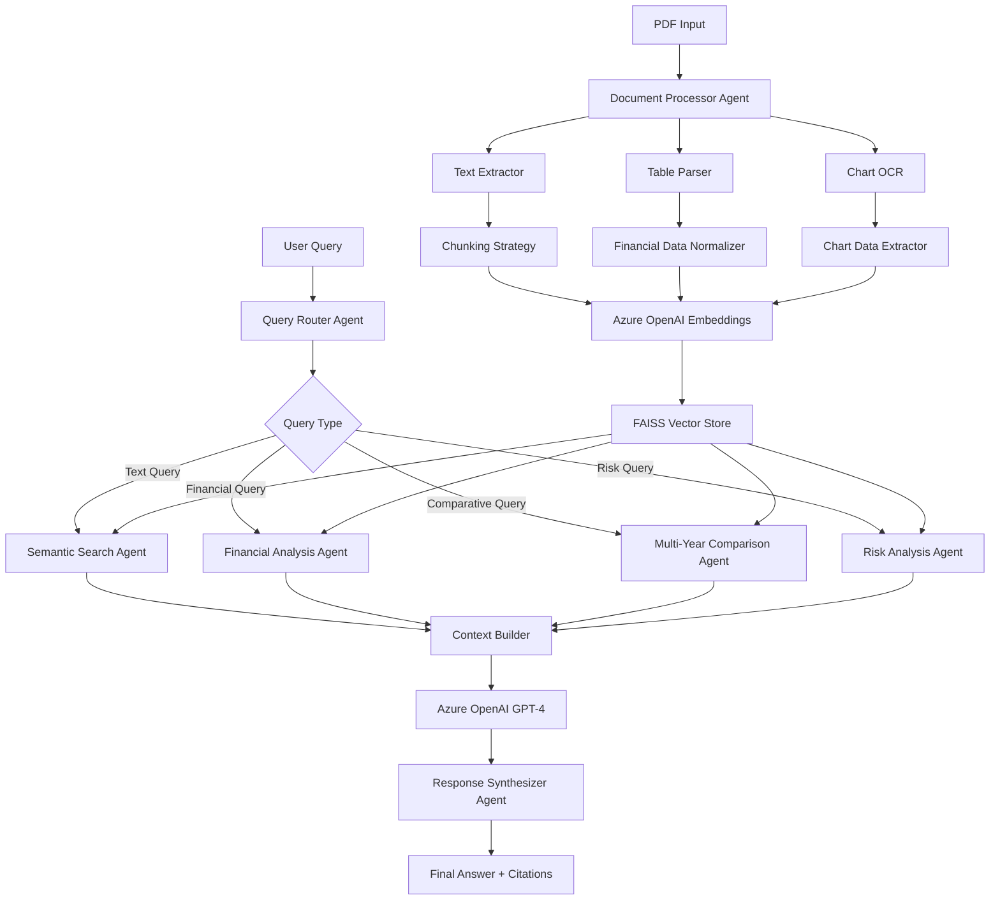

# Annual Report Analyzer MVP

An intelligent document analysis system that uses Azure OpenAI to extract insights from financial documents, particularly annual reports.

## 🚀 Quick Start

### 1. Setup Environment
```bash
# Run the setup script
python setup.py
```

### 2. Configure Azure OpenAI
Edit `.env` file with your Azure OpenAI credentials:
```env
AZURE_OPENAI_ENDPOINT=https://your-resource.openai.azure.com/
AZURE_OPENAI_API_KEY=your-api-key-here
AZURE_OPENAI_API_VERSION=2024-02-15-preview
```

### 3. Run the Application

**Interactive Mode:**
```bash
python main.py
```

**API Server Mode:**
```bash
python main.py --api
```

## 📋 Features

### Core Capabilities
- **PDF Document Processing**: Extract and analyze text from annual reports
- **Intelligent Chunking**: Smart text segmentation optimized for financial documents
- **Vector Search**: FAISS-powered semantic search across document content
- **AI-Powered Q&A**: Natural language queries with context-aware responses
- **REST API**: Complete web API for integration with other systems
- **Interactive CLI**: Command-line interface for easy document management

### Financial Document Optimization
- Specialized chunking for financial tables and metrics
- Risk factor identification and categorization
- Revenue and performance data extraction
- Contextual citation support

## 🏗️ Architecture

```
src/
├── api/              # FastAPI web application
├── azure/            # Azure OpenAI clients
├── extractors/       # Document text extraction
├── orchestrator/     # Main workflow coordination
├── rag/             # RAG pipeline components
└── utils/           # Configuration and utilities

config/              # Configuration files
tests/              # Unit and integration tests
```

## 📖 Usage

### Interactive Mode Commands
- `upload <file_path>`: Upload and process a PDF document
- `query <question>`: Ask questions about uploaded documents
- `list`: Show all uploaded documents
- `stats`: Display system statistics
- `health`: Check system health
- `quit`: Exit the application

### API Endpoints
- `GET /health`: System health check
- `POST /documents/upload`: Upload a document
- `POST /documents/query`: Query documents
- `GET /documents`: List all documents
- `GET /stats`: System statistics

### Example API Usage
```bash
# Upload a document
curl -X POST "http://localhost:8000/documents/upload" \
  -H "Content-Type: multipart/form-data" \
  -F "file=@annual_report_2024.pdf"

# Query documents
curl -X POST "http://localhost:8000/documents/query" \
  -H "Content-Type: application/json" \
  -d '{"query": "What was the revenue growth in 2024?"}'
```

## 🧪 Testing

### Run Unit Tests
```bash
pytest tests/ -v
```

### Run Integration Tests
```bash
pytest tests/ -m integration -v
```

### Manual Testing
1. Upload a sample PDF: Use a financial document or annual report
2. Query the document: Ask questions about financial metrics, risks, or performance
3. Check API endpoints: Test all REST API endpoints

## ⚙️ Configuration

### Main Configuration (`config/config.yaml`)
```yaml
rag:
  chunk_size: 1000          # Text chunk size
  chunk_overlap: 200        # Overlap between chunks
  max_context_chunks: 5     # Max chunks for context

api:
  host: "127.0.0.1"        # API server host
  port: 8000               # API server port
  debug: false             # Debug mode

azure_openai:
  chat_deployment_name: "gpt-4"
  embedding_deployment_name: "text-embedding-ada-002"
  max_tokens: 1000         # Max response tokens
  temperature: 0.1         # Response creativity
```

### Environment Variables (`.env`)
```env
# Azure OpenAI Configuration
AZURE_OPENAI_ENDPOINT=https://your-resource.openai.azure.com/
AZURE_OPENAI_API_KEY=your-api-key-here
AZURE_OPENAI_API_VERSION=2024-02-15-preview

# Optional: Override configuration
LOG_LEVEL=INFO
MAX_FILE_SIZE_MB=50
```

## 📊 System Requirements

- Python 3.8+
- Azure OpenAI subscription with:
  - GPT-4 deployment
  - text-embedding-ada-002 deployment
- 4GB+ RAM (for FAISS vector operations)
- 1GB+ disk space (for document storage and vectors)

## 🔧 Development

### Project Structure
```
llm-zoomcamp-project/
├── config/
│   ├── config.yaml           # Main configuration
│   └── .env.example         # Environment template
├── src/
│   ├── api/
│   │   └── fastapi_app.py   # FastAPI application
│   ├── azure/
│   │   ├── chat_client.py   # Chat completion client
│   │   └── embedding_client.py  # Embedding client
│   ├── extractors/
│   │   └── text_extractor.py    # PDF text extraction
│   ├── orchestrator/
│   │   └── mvp_orchestrator.py  # Main workflow
│   ├── rag/
│   │   ├── chunking_strategy.py # Text chunking
│   │   └── vector_store.py      # Vector database
│   └── utils/
│       ├── config.py        # Configuration management
│       └── logging_config.py    # Logging setup
├── tests/
│   └── test_mvp.py         # Test suite
├── main.py                 # Application entry point
├── requirements.txt        # Dependencies
├── setup.py               # Setup script
└── README.md              # This file
```

### Adding New Features
1. Follow the existing architecture patterns
2. Add configuration to `config.yaml` if needed
3. Include comprehensive error handling
4. Add tests in `tests/` directory
5. Update documentation

### Common Issues

#### Azure OpenAI Connection
- Verify endpoint URL format
- Check API key validity
- Ensure deployment names match your Azure resource

#### Import Errors
- Run `python setup.py` to install dependencies
- Activate virtual environment if using one
- Check Python version (3.8+ required)

#### Memory Issues
- Reduce `chunk_size` in configuration
- Process smaller documents
- Monitor system RAM usage

## 📝 Roadmap

### Phase 1: MVP Core ✅
- Basic document processing and Q&A
- Azure OpenAI integration
- Vector storage and retrieval
- REST API and CLI interface

### Phase 2: Enhanced Analytics (Planned)
- Advanced financial metrics extraction
- Comparative analysis across documents
- Export capabilities (PDF, Excel)
- Batch processing support

### Phase 3: Web Interface (Planned)
- React/Vue.js frontend
- Document visualization
- Interactive dashboards
- User management

### Phase 4: Enterprise Features (Planned)
- Multi-tenant support
- Advanced security features
- Audit logging
- Performance monitoring

## 🤝 Contributing

1. Fork the repository
2. Create a feature branch
3. Add tests for new functionality
4. Ensure all tests pass
5. Submit a pull request

## 📄 License

This project is licensed under the MIT License - see the LICENSE file for details.

## 🆘 Support

For issues and questions:
1. Check the troubleshooting section above
2. Review logs for detailed error information
3. Test with sample documents first
4. Verify Azure OpenAI configuration

---

**Note**: This is an MVP (Minimum Viable Product) focused on core functionality. Additional features and optimizations are planned for future phases.

---

## 🎯 **Key Improvements Over Basic RAG**

### **Financial Intelligence**
- 📊 **Table & Chart Extraction** - Parse financial statements, balance sheets, cash flows
- 🧮 **Financial Calculations** - Auto-compute ratios, YoY growth, margins with citations  
- 📈 **Multi-Year Analysis** - Compare metrics across reporting periods
- 🏛️ **Regulatory Structure** - Understand 10-K/10-Q sections, MD&A, risk factors

### **Advanced AI Stack**
- 🚀 **Azure OpenAI Integration** - GPT-4 for analysis, text-embedding-ada-002 for semantics
- 🔗 **LangChain RAG** - Hybrid retrieval (semantic + keyword), advanced chunking
- 🕸️ **LangGraph Orchestration** - Multi-agent workflow with specialized analysis agents
- 💾 **In-Memory Vector Store** - Fast FAISS-based similarity search

---

## 🏗️ **Enhanced System Architecture**



---

## 🧭 **Multi-Agent Workflow**

```python
# LangGraph Agent Flow
PDFs ──► Document Processor Agent ──► Chunking Strategy ──► Azure Embeddings ──► FAISS Store
                │                                                                    ▲
                ├── Table Parser ────────────────────────────────────────────────────┤
                ├── Chart OCR ───────────────────────────────────────────────────────┤
                └── Financial Data Normalizer ──────────────────────────────────────┤

User Query ──► Query Router Agent ──► Specialized Agents ──► Context Builder ──► GPT-4 ──► Response Synthesizer
                      │                       │
                      └── Financial Analysis  ├── Semantic Search
                          Multi-Year Compare  ├── Risk Analysis  
                          Regulatory Section  └── Citation Tracker
``` down a **modular, end-to-end pseudo‑code skeleton** for a simple RAG system focused on **PDF annual reports**, with **dummy data** and **stubs** for each step. You can treat this as a blueprint to implement in Python (or any language) in later iterations.

---

## 🧭 High-Level Flow

```
PDFs ──► Ingest (text per page) ──► Clean/Normalize ──► Chunk ──► Index (BM25)
                                  │                                    ▲
                                  └────────────► Metadata ─────────────┘

User Query ──► Retrieve (top‑k) ──► (optional) Rerank ──► Build Context ──► Answer
                                                            │
                                       Extractive (baseline)│ Generative (LLM optional)
                                                            │
                                                     Citations (file, page)
```

---

## 📁 **Optimized Project Structure**

```
annual_report_analyzer/
  ├── config/
  │   ├── settings.yaml                 # System configuration
  │   ├── azure_config.yaml             # Azure OpenAI settings  
  │   └── agent_prompts.yaml            # Agent-specific prompts
  │   
  ├── data/
  │   ├── pdfs/                         # Input annual reports
  │   ├── processed/                    # Processed chunks & metadata
  │   └── cache/                        # Embeddings & index cache
  │   
  ├── src/
  │   ├── agents/                       # LangGraph Agents
  │   │   ├── document_processor.py     # PDF → structured data
  │   │   ├── financial_analyzer.py     # Financial calculations
  │   │   ├── query_router.py           # Route queries to specialists
  │   │   ├── semantic_searcher.py      # Vector similarity search
  │   │   ├── risk_analyzer.py          # Risk factor extraction
  │   │   └── response_synthesizer.py   # Final answer generation
  │   │   
  │   ├── extractors/                   # Specialized Data Extraction
  │   │   ├── text_extractor.py         # Clean text extraction
  │   │   ├── table_parser.py           # Financial table parsing
  │   │   ├── chart_ocr.py              # Chart/graph data extraction
  │   │   └── financial_normalizer.py   # Standardize financial data
  │   │   
  │   ├── rag/                          # RAG Components
  │   │   ├── chunking_strategy.py      # Smart document chunking
  │   │   ├── vector_store.py           # FAISS vector operations
  │   │   ├── retrieval_engine.py       # Hybrid search (semantic + keyword)
  │   │   ├── reranker.py               # Context relevance ranking
  │   │   └── context_builder.py        # Multi-source context assembly
  │   │   
  │   ├── azure/                        # Azure OpenAI Integration
  │   │   ├── embedding_client.py       # text-embedding-ada-002
  │   │   ├── chat_client.py            # GPT-4 for analysis
  │   │   ├── credential_manager.py     # Managed Identity auth
  │   │   └── rate_limiter.py           # API quota management
  │   │   
  │   ├── financial/                    # Financial Intelligence
  │   │   ├── calculator.py             # YoY growth, ratios, margins
  │   │   ├── comparator.py             # Multi-year analysis
  │   │   ├── validator.py              # Data consistency checks
  │   │   └── formatter.py              # Financial data presentation
  │   │   
  │   ├── orchestrator/                 # LangGraph Orchestration
  │   │   ├── workflow_graph.py         # Agent coordination graph
  │   │   ├── state_manager.py          # Conversation state
  │   │   └── execution_engine.py       # Workflow execution
  │   │   
  │   └── utils/
  │       ├── logging_config.py         # Structured logging
  │       ├── metrics.py                # Performance monitoring
  │       └── validators.py             # Input validation
  │       
  ├── tests/
  │   ├── test_agents/                  # Agent unit tests
  │   ├── test_extractors/              # Extractor tests
  │   ├── test_financial/               # Financial calc tests
  │   └── integration/                  # End-to-end tests
  │   
  ├── notebooks/                        # Analysis & Development
  │   ├── data_exploration.ipynb        # PDF structure analysis
  │   ├── embedding_analysis.ipynb      # Vector space exploration  
  │   └── agent_testing.ipynb           # Agent behavior testing
  │   
  ├── api/
  │   ├── fastapi_app.py               # REST API endpoints
  │   ├── websocket_handler.py         # Real-time analysis
  │   └── middleware.py                # Auth, logging, CORS
  │   
  ├── deployment/
  │   ├── infra/                       # Azure infrastructure
  │   │   ├── main.bicep              # Azure resources
  │   │   └── parameters.json         # Deployment parameters
  │   ├── docker/
  │   │   └── Dockerfile              # Containerization
  │   └── azure.yaml                  # AZD configuration
  │   
  └── requirements.txt                 # Python dependencies
```

---

## ⚙️ **Core Technology Stack**

### **AI & ML Layer**
```yaml
Azure OpenAI:
  embedding_model: "text-embedding-ada-002"    # 1536 dimensions
  chat_model: "gpt-4"                          # Analysis & reasoning
  api_version: "2024-02-01"                    # Latest stable
  
LangChain Components:
  document_loaders: "PyMuPDFLoader, UnstructuredPDFLoader"
  text_splitters: "RecursiveCharacterTextSplitter, SemanticChunker"
  vectorstores: "FAISS (in-memory), Chroma (optional)"
  retrievers: "MultiQueryRetriever, EnsembleRetriever"
  agents: "CustomAgent, StructuredChatAgent"

LangGraph Orchestration:
  state_management: "TypedDict state graphs"
  agent_coordination: "Conditional routing & parallel execution"
  memory: "ConversationBufferWindowMemory"
```

### **Financial Processing**
```yaml
Document Processing:
  pdf_parsing: "PyMuPDF, pdfplumber, camelot-py"
  table_extraction: "tabula-py, pdfplumber"
  ocr_capability: "Azure AI Document Intelligence"
  
Financial Intelligence:
  calculation_engine: "pandas, numpy"
  data_validation: "Great Expectations"
  time_series: "pandas financial analysis"
```

### **Infrastructure & Deployment**
```yaml
Vector Storage:
  in_memory: "FAISS with pickle persistence"  # Fast startup
  scalable_option: "Azure AI Search"          # Production ready
  
API Framework:
  web_framework: "FastAPI"                    # High performance
  async_support: "asyncio, aiofiles"
  websocket: "Real-time analysis streaming"
  
Azure Services:
  compute: "Azure Container Apps"             # Serverless containers  
  storage: "Azure Blob Storage"               # Document storage
  security: "Azure Key Vault, Managed Identity"
  monitoring: "Azure Application Insights"
```

---

## 🔧 **Enhanced Configuration System**

### **settings.yaml**
```yaml
# System Configuration
app:
  name: "Annual Report Analyzer"
  version: "2.0.0"
  environment: "development"

# Document Processing
document_processing:
  max_file_size_mb: 50
  supported_formats: ["pdf"]
  extract_tables: true
  extract_charts: true
  ocr_enabled: true

# Chunking Strategy  
chunking:
  strategy: "semantic_adaptive"  # semantic_adaptive, recursive, fixed
  target_chunk_size: 1000
  chunk_overlap: 200
  min_chunk_size: 100
  semantic_similarity_threshold: 0.8

# Retrieval Configuration
retrieval:
  hybrid_search: true
  semantic_weight: 0.7
  keyword_weight: 0.3
  top_k_initial: 20
  top_k_final: 5
  reranking_enabled: true

# Financial Analysis
financial:
  currency_detection: true
  number_extraction: true
  ratio_calculations: ["ROE", "ROA", "debt_to_equity", "current_ratio"]
  yoy_analysis: true
  trend_detection: true
```

### **azure_config.yaml**
```yaml
# Azure OpenAI Configuration
azure_openai:
  endpoint: "${AZURE_OPENAI_ENDPOINT}"
  api_key: "${AZURE_OPENAI_API_KEY}"  # Use Managed Identity in production
  api_version: "2024-02-01"
  
  # Embedding Model
  embedding:
    deployment_name: "text-embedding-ada-002"
    model_name: "text-embedding-ada-002"
    chunk_size: 1000
    max_retries: 3
    timeout: 30
    
  # Chat Model  
  chat:
    deployment_name: "gpt-4"
    model_name: "gpt-4"
    max_tokens: 4000
    temperature: 0.1        # Low for factual analysis
    top_p: 0.9
    frequency_penalty: 0.0
    presence_penalty: 0.0

# Rate Limiting
rate_limits:
  requests_per_minute: 240
  tokens_per_minute: 40000
  concurrent_requests: 10
  backoff_factor: 2.0
```

---

## 🤖 **Multi-Agent System Design**

### **1. Document Processor Agent**
```python
class DocumentProcessorAgent:
    """Handles PDF ingestion and initial processing"""
    
    capabilities = [
        "PDF text extraction with layout preservation",
        "Financial table detection and parsing", 
        "Chart/graph OCR and data extraction",
        "Document structure analysis (sections, footnotes)",
        "Metadata extraction (filing date, company, period)"
    ]
    
    tools = [
        "PyMuPDF for text extraction",
        "pdfplumber for table parsing", 
        "Azure AI Document Intelligence for OCR",
        "Regular expressions for structure detection"
    ]
```

### **2. Financial Analysis Agent**
```python  
class FinancialAnalysisAgent:
    """Specialized in financial calculations and analysis"""
    
    capabilities = [
        "Automatic ratio calculations (ROE, ROA, margins)",
        "Year-over-year growth analysis",
        "Financial trend detection",
        "Cross-period comparisons",
        "Data consistency validation"
    ]
    
    financial_knowledge = [
        "GAAP accounting principles",
        "Financial statement relationships", 
        "Industry standard ratios",
        "Regulatory reporting requirements"
    ]
```

### **3. Query Router Agent**
```python
class QueryRouterAgent:
    """Intelligently routes queries to specialized agents"""
    
    routing_logic = {
        "financial_metrics": "FinancialAnalysisAgent",
        "risk_factors": "RiskAnalysisAgent", 
        "text_search": "SemanticSearchAgent",
        "multi_year_comparison": "ComparisonAgent",
        "regulatory_compliance": "ComplianceAgent"
    }
    
    query_classification = [
        "Entity extraction (companies, dates, metrics)",
        "Intent classification (search, calculate, compare)",
        "Complexity assessment (simple lookup vs. analysis)"
    ]
```

### **4. Response Synthesizer Agent**
```python
class ResponseSynthesizerAgent:
    """Combines multi-agent outputs into coherent responses"""
    
    synthesis_capabilities = [
        "Multi-source evidence integration",
        "Conflicting information resolution",
        "Citation formatting and validation", 
        "Confidence scoring",
        "Follow-up question suggestions"
    ]
```

---

## 🚀 **Implementation Architecture**

### **1. Azure OpenAI Integration**

```python
# src/azure/embedding_client.py
from openai import AzureOpenAI
from azure.identity import DefaultAzureCredential
import numpy as np
from typing import List, Dict

class AzureEmbeddingClient:
    """Secure Azure OpenAI embedding client with rate limiting"""
    
    def __init__(self, config: Dict):
        # Use Managed Identity for authentication
        credential = DefaultAzureCredential()
        
        self.client = AzureOpenAI(
            azure_endpoint=config["endpoint"],
            azure_ad_token_provider=credential.get_token("https://cognitiveservices.azure.com/.default"),
            api_version=config["api_version"]
        )
        
        self.deployment_name = config["embedding"]["deployment_name"]
        self.rate_limiter = RateLimiter(config["rate_limits"])
        
    async def get_embeddings(self, texts: List[str]) -> List[np.ndarray]:
        """Get embeddings for text chunks with batching and retry logic"""
        embeddings = []
        
        # Process in batches to respect rate limits
        for batch in self._batch_texts(texts, batch_size=16):
            await self.rate_limiter.acquire()
            
            try:
                response = await self.client.embeddings.create(
                    input=batch,
                    model=self.deployment_name
                )
                
                batch_embeddings = [np.array(item.embedding) for item in response.data]
                embeddings.extend(batch_embeddings)
                
            except Exception as e:
                logger.error(f"Embedding error: {e}")
                # Implement exponential backoff retry
                embeddings.extend([np.zeros(1536)] * len(batch))
                
        return embeddings

# src/azure/chat_client.py  
class AzureChatClient:
    """GPT-4 client for financial analysis with structured outputs"""
    
    def __init__(self, config: Dict):
        credential = DefaultAzureCredential()
        
        self.client = AzureOpenAI(
            azure_endpoint=config["endpoint"],
            azure_ad_token_provider=credential.get_token("https://cognitiveservices.azure.com/.default"),
            api_version=config["api_version"]
        )
        
        self.deployment_name = config["chat"]["deployment_name"]
        self.default_params = config["chat"]
        
    async def analyze_financial_context(
        self, 
        context: str, 
        query: str,
        analysis_type: str = "general"
    ) -> Dict:
        """Analyze financial context with specialized prompts"""
        
        prompt = self._build_analysis_prompt(context, query, analysis_type)
        
        try:
            response = await self.client.chat.completions.create(
                model=self.deployment_name,
                messages=[
                    {"role": "system", "content": FINANCIAL_ANALYST_SYSTEM_PROMPT},
                    {"role": "user", "content": prompt}
                ],
                max_tokens=self.default_params["max_tokens"],
                temperature=self.default_params["temperature"],
                response_format={"type": "json_object"}  # Structured output
            )
            
            return json.loads(response.choices[0].message.content)
            
        except Exception as e:
            logger.error(f"Chat analysis error: {e}")
            return {"error": str(e), "fallback_response": True}
```

### **2. LangChain RAG Implementation**

```python
# src/rag/chunking_strategy.py
from langchain.text_splitter import RecursiveCharacterTextSplitter
from langchain_experimental.text_splitter import SemanticChunker
from langchain_openai import AzureOpenAIEmbeddings

class SmartChunkingStrategy:
    """Adaptive chunking based on document structure and semantics"""
    
    def __init__(self, azure_config: Dict):
        self.embeddings = AzureOpenAIEmbeddings(
            azure_deployment=azure_config["embedding"]["deployment_name"],
            azure_endpoint=azure_config["endpoint"],
            api_version=azure_config["api_version"]
        )
        
        # Different splitters for different content types
        self.text_splitter = RecursiveCharacterTextSplitter(
            chunk_size=1000,
            chunk_overlap=200,
            separators=["\n\n", "\n", ". ", " ", ""]
        )
        
        self.semantic_splitter = SemanticChunker(
            embeddings=self.embeddings,
            breakpoint_threshold_type="percentile",
            breakpoint_threshold_amount=95
        )
        
    def chunk_financial_document(self, document: Document) -> List[Document]:
        """Smart chunking based on document section type"""
        
        sections = self._identify_sections(document.page_content)
        chunks = []
        
        for section_type, content in sections.items():
            if section_type == "financial_table":
                # Preserve table structure
                chunks.extend(self._chunk_table_content(content))
            elif section_type == "narrative_text":
                # Use semantic chunking for better context preservation
                chunks.extend(self.semantic_splitter.split_text(content))
            else:
                # Standard recursive chunking
                chunks.extend(self.text_splitter.split_text(content))
                
        return self._add_metadata(chunks, document)

# src/rag/vector_store.py
import faiss
import pickle
from pathlib import Path
from typing import List, Tuple

class FAISSVectorStore:
    """High-performance in-memory vector store with persistence"""
    
    def __init__(self, dimension: int = 1536):
        self.dimension = dimension
        self.index = faiss.IndexFlatIP(dimension)  # Inner Product for cosine similarity
        self.documents = []
        self.metadata = []
        
    def add_documents(self, documents: List[Document], embeddings: List[np.ndarray]):
        """Add documents and their embeddings to the index"""
        
        # Normalize embeddings for cosine similarity
        embeddings_array = np.array(embeddings).astype('float32')
        faiss.normalize_L2(embeddings_array)
        
        self.index.add(embeddings_array)
        self.documents.extend(documents)
        self.metadata.extend([doc.metadata for doc in documents])
        
    def similarity_search(self, query_embedding: np.ndarray, k: int = 5) -> List[Tuple[Document, float]]:
        """Semantic similarity search with scores"""
        
        query_vector = query_embedding.reshape(1, -1).astype('float32')
        faiss.normalize_L2(query_vector)
        
        scores, indices = self.index.search(query_vector, k)
        
        results = []
        for score, idx in zip(scores[0], indices[0]):
            if idx != -1:  # Valid result
                results.append((self.documents[idx], float(score)))
                
        return results
        
    def save(self, path: str):
        """Persist vector store to disk"""
        Path(path).parent.mkdir(parents=True, exist_ok=True)
        
        # Save FAISS index
        faiss.write_index(self.index, f"{path}/index.faiss")
        
        # Save documents and metadata
        with open(f"{path}/documents.pkl", "wb") as f:
            pickle.dump({
                "documents": self.documents,
                "metadata": self.metadata
            }, f)
```

### **3. LangGraph Agent Orchestration**

```python
# src/orchestrator/workflow_graph.py
from langgraph import StateGraph, CompiledGraph
from typing import Dict, Any, List
from typing_extensions import TypedDict

class AnalysisState(TypedDict):
    """Shared state across all agents"""
    query: str
    document_path: str
    processed_chunks: List[Document]
    retrieval_results: List[Tuple[Document, float]]
    financial_calculations: Dict[str, Any]
    risk_analysis: Dict[str, Any] 
    final_answer: str
    citations: List[Dict[str, Any]]
    confidence_score: float

class FinancialAnalysisWorkflow:
    """LangGraph orchestrator for multi-agent financial analysis"""
    
    def __init__(self, agents: Dict[str, Any], config: Dict):
        self.agents = agents
        self.config = config
        self.workflow = self._build_workflow()
        
    def _build_workflow(self) -> CompiledGraph:
        """Define the agent coordination workflow"""
        
        workflow = StateGraph(AnalysisState)
        
        # Add agent nodes
        workflow.add_node("document_processor", self._process_document)
        workflow.add_node("query_router", self._route_query)
        workflow.add_node("semantic_search", self._semantic_search)
        workflow.add_node("financial_analyzer", self._financial_analysis)
        workflow.add_node("risk_analyzer", self._risk_analysis)  
        workflow.add_node("response_synthesizer", self._synthesize_response)
        
        # Define workflow edges
        workflow.add_edge("document_processor", "query_router")
        workflow.add_conditional_edges(
            "query_router",
            self._route_decision,
            {
                "financial": "financial_analyzer",
                "risk": "risk_analyzer", 
                "general": "semantic_search"
            }
        )
        
        # Parallel execution for comprehensive analysis
        workflow.add_edge("financial_analyzer", "response_synthesizer")
        workflow.add_edge("risk_analyzer", "response_synthesizer")
        workflow.add_edge("semantic_search", "response_synthesizer")
        
        # Set entry and exit points
        workflow.set_entry_point("document_processor")
        workflow.set_finish_point("response_synthesizer")
        
        return workflow.compile()
        
    async def analyze(self, query: str, document_path: str) -> Dict[str, Any]:
        """Execute the complete analysis workflow"""
        
        initial_state = AnalysisState(
            query=query,
            document_path=document_path,
            processed_chunks=[],
            retrieval_results=[],
            financial_calculations={},
            risk_analysis={},
            final_answer="",
            citations=[],
            confidence_score=0.0
        )
        
        # Execute workflow
        result = await self.workflow.ainvoke(initial_state)
        
        return {
            "answer": result["final_answer"],
            "citations": result["citations"],
            "confidence": result["confidence_score"],
            "supporting_data": {
                "financial_calculations": result["financial_calculations"],
                "risk_analysis": result["risk_analysis"]
            }
        }
```

---

## 📊 **Advanced Financial Intelligence**

### **Financial Calculator**
```python
# src/financial/calculator.py
import pandas as pd
import numpy as np
from typing import Dict, List, Tuple

class FinancialCalculator:
    """Automated financial ratio and growth calculations"""
    
    def __init__(self):
        self.standard_ratios = {
            "profitability": ["ROE", "ROA", "gross_margin", "operating_margin", "net_margin"],
            "liquidity": ["current_ratio", "quick_ratio", "cash_ratio"],
            "leverage": ["debt_to_equity", "debt_to_assets", "interest_coverage"],
            "efficiency": ["asset_turnover", "inventory_turnover", "receivables_turnover"]
        }
    
    def calculate_yoy_growth(self, current: float, previous: float) -> Dict[str, float]:
        """Calculate year-over-year growth metrics"""
        if previous == 0:
            return {"growth_rate": float('inf'), "absolute_change": current}
            
        growth_rate = (current - previous) / previous
        absolute_change = current - previous
        
        return {
            "growth_rate": growth_rate,
            "growth_percentage": growth_rate * 100,
            "absolute_change": absolute_change,
            "current_value": current,
            "previous_value": previous
        }
    
    def calculate_financial_ratios(self, financial_data: Dict[str, float]) -> Dict[str, float]:
        """Calculate standard financial ratios from extracted data"""
        ratios = {}
        
        # Profitability ratios
        if "net_income" in financial_data and "shareholders_equity" in financial_data:
            ratios["ROE"] = financial_data["net_income"] / financial_data["shareholders_equity"]
            
        if "net_income" in financial_data and "total_assets" in financial_data:
            ratios["ROA"] = financial_data["net_income"] / financial_data["total_assets"]
            
        # Add more ratio calculations...
        
        return ratios

# src/financial/comparator.py  
class MultiYearComparator:
    """Compare financial metrics across multiple reporting periods"""
    
    def compare_annual_reports(self, reports: List[Dict]) -> Dict[str, Any]:
        """Compare key metrics across multiple annual reports"""
        
        comparison = {
            "revenue_trend": [],
            "profitability_trend": [],
            "growth_analysis": {},
            "key_changes": []
        }
        
        # Sort reports by year
        sorted_reports = sorted(reports, key=lambda x: x["year"])
        
        # Calculate trends
        for i in range(1, len(sorted_reports)):
            current = sorted_reports[i]
            previous = sorted_reports[i-1]
            
            # Revenue growth
            if "revenue" in current and "revenue" in previous:
                growth = self.calculator.calculate_yoy_growth(
                    current["revenue"], 
                    previous["revenue"]
                )
                comparison["revenue_trend"].append({
                    "year": current["year"],
                    "growth": growth
                })
        
        return comparison
```

---

## 🔄 **Development & Deployment Pipeline**

### **requirements.txt**
```txt
# Core AI/ML
langchain>=0.1.0
langchain-openai>=0.1.0
langgraph>=0.0.40
openai>=1.12.0
faiss-cpu>=1.8.0
numpy>=1.24.0
pandas>=2.0.0

# PDF Processing
PyMuPDF>=1.23.0
pdfplumber>=0.10.0
camelot-py[cv]>=0.11.0
tabula-py>=2.8.0

# Azure Integration
azure-identity>=1.15.0
azure-keyvault-secrets>=4.7.0
azure-ai-documentintelligence>=1.0.0b1

# Web Framework
fastapi>=0.104.0
uvicorn>=0.24.0
websockets>=12.0

# Data Processing
great-expectations>=0.18.0
pydantic>=2.5.0
python-multipart>=0.0.6

# Development & Testing
pytest>=7.4.0
pytest-asyncio>=0.21.0
black>=23.0.0
isort>=5.12.0
```

### **Docker Support**
```dockerfile
# deployment/docker/Dockerfile
FROM python:3.11-slim

WORKDIR /app

# Install system dependencies for PDF processing
RUN apt-get update && apt-get install -y \
    libgl1-mesa-glx \
    libglib2.0-0 \
    libsm6 \
    libxext6 \
    libxrender-dev \
    libgomp1 \
    && rm -rf /var/lib/apt/lists/*

# Copy requirements and install Python dependencies
COPY requirements.txt .
RUN pip install --no-cache-dir -r requirements.txt

# Copy application code
COPY src/ ./src/
COPY config/ ./config/

# Create non-root user for security
RUN useradd -m -u 1000 appuser && chown -R appuser:appuser /app
USER appuser

EXPOSE 8000

CMD ["uvicorn", "src.api.fastapi_app:app", "--host", "0.0.0.0", "--port", "8000"]
```

---

## ✅ **Key Design Improvements & Comments**

### **🎯 Technical Excellence**
1. **Azure OpenAI Best Practices** - Managed Identity auth, rate limiting, retry logic
2. **Smart Chunking** - Semantic + structure-aware chunking for better context
3. **Multi-Agent Architecture** - Specialized agents for different analysis types
4. **Financial Intelligence** - Built-in calculations, ratio analysis, YoY comparisons
5. **Hybrid Retrieval** - Semantic (FAISS) + keyword search fusion

### **🔒 Security & Production Readiness**
1. **No hardcoded credentials** - Azure Managed Identity + Key Vault
2. **Rate limiting & error handling** - Robust API quota management  
3. **Input validation** - Comprehensive data validation pipeline
4. **Structured logging** - Azure Application Insights integration
5. **Container-ready** - Docker support for easy deployment

### **📈 Performance & Scalability**
1. **In-memory FAISS** - Fast vector similarity search
2. **Async operations** - Non-blocking I/O for better throughput
3. **Batch processing** - Efficient embedding generation
4. **Caching strategy** - Persist processed documents and embeddings
5. **Azure Container Apps** - Serverless auto-scaling

### **🛠️ Alternative Tech Stack Considerations**

**Vector Database Options:**
- **Current**: FAISS (in-memory) - Fast, simple, good for single PDF
- **Scale-up**: Azure AI Search - Production-grade, hybrid search, managed
- **Alternative**: Pinecone, Weaviate - Specialized vector databases

**LLM Framework Alternatives:**
- **Current**: LangChain + LangGraph - Rich ecosystem, good abstraction
- **Alternative**: Haystack - More control, pipeline-focused
- **Lightweight**: Direct OpenAI API calls - Less abstraction, more control

**Document Processing:**
- **Current**: PyMuPDF + pdfplumber - Good balance of speed/accuracy
- **Advanced**: Azure AI Document Intelligence - Superior table/form extraction
- **Alternative**: Unstructured.io - Better layout understanding

Would you like me to implement any specific component first or create the initial project structure?
    chunk_size: 1000
    max_retries: 3
    timeout: 30
    
  # Chat Model  
  chat:
    deployment_name: "gpt-4"
    model_name: "gpt-4"
    max_tokens: 4000
    temperature: 0.1        # Low for factual analysis
    top_p: 0.9
    frequency_penalty: 0.0
    presence_penalty: 0.0

# Rate Limiting
rate_limits:
  requests_per_minute: 240
  tokens_per_minute: 40000
  concurrent_requests: 10
  backoff_factor: 2.0
```

---

## 🤖 **Multi-Agent System Design**

### **1. Document Processor Agent**
```python
class DocumentProcessorAgent:
    """Handles PDF ingestion and initial processing"""
    
    capabilities = [
        "PDF text extraction with layout preservation",
        "Financial table detection and parsing", 
        "Chart/graph OCR and data extraction",
        "Document structure analysis (sections, footnotes)",
        "Metadata extraction (filing date, company, period)"
    ]
    
    tools = [
        "PyMuPDF for text extraction",
        "pdfplumber for table parsing", 
        "Azure AI Document Intelligence for OCR",
        "Regular expressions for structure detection"
    ]
```

### **2. Financial Analysis Agent**
```python  
class FinancialAnalysisAgent:
    """Specialized in financial calculations and analysis"""
    
    capabilities = [
        "Automatic ratio calculations (ROE, ROA, margins)",
        "Year-over-year growth analysis",
        "Financial trend detection",
        "Cross-period comparisons",
        "Data consistency validation"
    ]
    
    financial_knowledge = [
        "GAAP accounting principles",
        "Financial statement relationships", 
        "Industry standard ratios",
        "Regulatory reporting requirements"
    ]
```

### **3. Query Router Agent**
```python
class QueryRouterAgent:
    """Intelligently routes queries to specialized agents"""
    
    routing_logic = {
        "financial_metrics": "FinancialAnalysisAgent",
        "risk_factors": "RiskAnalysisAgent", 
        "text_search": "SemanticSearchAgent",
        "multi_year_comparison": "ComparisonAgent",
        "regulatory_compliance": "ComplianceAgent"
    }
    
    query_classification = [
        "Entity extraction (companies, dates, metrics)",
        "Intent classification (search, calculate, compare)",
        "Complexity assessment (simple lookup vs. analysis)"
    ]
```

### **4. Response Synthesizer Agent**
```python
class ResponseSynthesizerAgent:
    """Combines multi-agent outputs into coherent responses"""
    
    synthesis_capabilities = [
        "Multi-source evidence integration",
        "Conflicting information resolution",
        "Citation formatting and validation", 
        "Confidence scoring",
        "Follow-up question suggestions"
    ]
```

---

# 2) Ingestion (PDF → pages)

```pseudo
# rag/ingest.pseudo
function load_pdfs(pdf_folder: String) -> List[Page]:
  pages = []
  for each path in list_files(pdf_folder, pattern="*.pdf"):
    try:
      doc = open_pdf(path)  # PyMuPDF or similar
      for i in range(doc.num_pages):
        raw = doc.page(i).get_text("text")
        if raw is not empty:
          pages.append({ file: basename(path), page: i, text: raw })
      close_pdf(doc)
    catch e:
      log_warn("Failed: " + path + " err=" + e)
  return pages

# --- Dummy data example (simulate ingestion result) ---
DUMMY_PAGES = [
  { file: "ACME_2024_AR.pdf", page: 0,
    text: "ACME Corporation Annual Report 2024. Total revenue was $5.2 billion, up 8% YoY." },
  { file: "ACME_2024_AR.pdf", page: 1,
    text: "Risk factors include supply chain disruptions and FX volatility." },
  { file: "ACME_2023_AR.pdf", page: 0,
    text: "ACME Corporation Annual Report 2023. Total revenue was $4.8 billion." }
]
```

---

# 3) Preprocess (cleaning, normalization)

```pseudo
# rag/preprocess.pseudo
function normalize_whitespace(s: String) -> String:
  return replace_regex(s, pattern="\s+", by=" ").trim()

function preprocess_pages(pages: List[Page]) -> List[Page]:
  for each p in pages:
    p.text = normalize_whitespace(p.text)
  return pages

# --- Dummy transformation ---
# "ACME   2024.\nRevenue  $5.2B " -> "ACME 2024. Revenue $5.2B"
```

---

# 4) Chunking (sentences → chunks)

```pseudo
# rag/chunk.pseudo
function split_sentences(text: String) -> List[String]:
  # naive split on .?! followed by space
  return regex_split(text, "(?<=[.?!])\s+")

function make_chunks(pages: List[Page],
                     target_chars: Int,
                     overlap_chars: Int) -> List[Chunk]:
  chunks = []
  for each p in pages:
    sents = split_sentences(p.text)
    buf = ""
    for each s in sents:
      if length(buf + s) > target_chars and buf != "":
        chunks.append({
          id: hash(p.file + ":" + p.page + ":" + buf[:50]),
          file: p.file, page_start: p.page, page_end: p.page, text: buf.trim()
        })
        # overlap tail
        if overlap_chars > 0 and length(buf) > overlap_chars:
          buf = substring(buf, length(buf) - overlap_chars, overlap_chars) + " "
        else:
          buf = ""
      buf = buf + s + " "
    if buf.trim() != "":
      chunks.append({
        id: hash(p.file + ":" + p.page + ":" + buf[:50]),
        file: p.file, page_start: p.page, page_end: p.page, text: buf.trim()
      })
  return unique(chunks)  # dedupe by (file, page range, text prefix)

# --- Dummy chunks result ---
DUMMY_CHUNKS = [
  { id: "c1", file: "ACME_2024_AR.pdf", page_start: 1, page_end: 1,
    text: "Risk factors include supply chain disruptions and FX volatility." },
  { id: "c2", file: "ACME_2024_AR.pdf", page_start: 0, page_end: 0,
    text: "ACME Corporation Annual Report 2024. Total revenue was $5.2 billion, up 8% YoY." },
  { id: "c3", file: "ACME_2023_AR.pdf", page_start: 0, page_end: 0,
    text: "ACME Corporation Annual Report 2023. Total revenue was $4.8 billion." }
]
```

---

# 5) Index (Baseline: BM25 Sparse)

```pseudo
# rag/index.pseudo
function tokenize(text: String) -> List[String]:
  return regex_findall(text.lower(), "[a-z0-9]+(?:['-][a-z0-9]+)?")

class BM25Index:
  init(chunks: List[Chunk]):
    self.docs = [tokenize(c.text) for c in chunks]
    self.meta = chunks  # keep chunk association
    self.N = len(self.docs)
    self.doc_len = [len(d) for d in self.docs]
    self.avgdl = average(self.doc_len)
    self.df = compute_doc_frequency(self.docs)
    self.idf = compute_bm25_idf(self.N, self.df)
    self.k1 = 1.5
    self.b = 0.75

  function score(q_tokens: List[String], doc_id: Int) -> Float:
    tf = term_counts(self.docs[doc_id])
    dl = self.doc_len[doc_id]
    s = 0
    for t in q_tokens:
      if t not in tf: continue
      f = tf[t]
      idf = self.idf.get(t, 0)
      denom = f + self.k1 * (1 - self.b + self.b * dl / self.avgdl)
      s += idf * (f * (self.k1 + 1)) / max(denom, 1e-9)
    return s

  function retrieve(query: String, top_k: Int) -> List[RetrievalResult]:
    q_tokens = tokenize(query)
    scored = []
    for i in range(self.N):
      s = self.score(q_tokens, i)
      if s > 0: scored.append({ chunk: self.meta[i], score: s })
    return sort_desc(scored, key=score)[:top_k]

# --- Dummy BM25 outcome for query "What was revenue in 2024?" ---
DUMMY_RETRIEVAL = [
  { chunk: DUMMY_CHUNKS[1], score: 3.21 },  # mentions "2024" + "revenue"
  { chunk: DUMMY_CHUNKS[2], score: 1.85 }   # 2023 revenue (context)
]
```

> *We’ll add embeddings/hybrid search in a later iteration.*

---

# 6) (Optional) Reranker

```pseudo
# rag/rerank.pseudo
# Stub that could use lexical + lightweight semantic signals
function rerank(results: List[RetrievalResult], query: String) -> List[RetrievalResult]:
  # baseline: return as-is
  return results

# --- Dummy ---
DUMMY_RERANKED = DUMMY_RETRIEVAL
```

---

# 7) Context Builder (for LLM or extractive)

```pseudo
# rag/context.pseudo
function build_context(results: List[RetrievalResult], max_chars: Int = 6000) -> String:
  buf = ""
  for r in results:
    snippet = "[" + r.chunk.file + " p." + (r.chunk.page_start + 1) + "]\n" +
              r.chunk.text + "\n\n"
    if length(buf) + length(snippet) > max_chars: break
    buf = buf + snippet
  return buf

# --- Dummy context ---
DUMMY_CONTEXT = """
[ACME_2024_AR.pdf p.1]
ACME Corporation Annual Report 2024. Total revenue was $5.2 billion, up 8% YoY.

[ACME_2023_AR.pdf p.1]
ACME Corporation Annual Report 2023. Total revenue was $4.8 billion.
"""
```

---

# 8) Answerers

### 8a) Extractive (baseline, no LLM)

```pseudo
# rag/answer.pseudo
function extractive_answer(query: String,
                           results: List[RetrievalResult],
                           max_sentences: Int = 3) -> Answer:
  q_tokens = set(tokenize(query))
  candidates = []
  for r in results:
    sents = split_sentences(r.chunk.text)
    for s in sents:
      t = set(tokenize(s))
      if size(t) == 0: continue
      overlap = size(q_tokens ∩ t) / max(size(q_tokens ∪ t), 1)
      if overlap > 0:
        candidates.append({ sent: s, overlap: overlap, chunk: r.chunk })
  sorted_cands = sort_desc(candidates, key=overlap)[:max_sentences]
  if empty(sorted_cands):
    return { text: "Not found in context. Try rephrasing.",
             citations: [] }
  # format with citations
  lines = []
  cites = []
  for c in sorted_cands:
    lines.append("- " + c.sent + " (Source: " + c.chunk.file +
                 ", p." + (c.chunk.page_start + 1) + ")")
    cites.append({ file: c.chunk.file, page: c.chunk.page_start + 1 })
  return { text: join(lines, "\n"), citations: unique(cites) }

# --- Dummy extractive answer for query "What was revenue in 2024?" ---
DUMMY_EXTRACTIVE_ANSWER = {
  text: "- Total revenue was $5.2 billion, up 8% YoY. (Source: ACME_2024_AR.pdf, p.1)",
  citations: [{ file: "ACME_2024_AR.pdf", page: 1 }]
}
```

### 8b) Generative (LLM-ready prompt)

```pseudo
# rag/answer.pseudo
GEN_PROMPT = """
You are a financial analysis assistant. Answer strictly using the provided context.
If the answer is not present, say you don't know. Cite as (filename, p.X).

# Question
{QUESTION}

# Context
{CONTEXT}

# Instructions
- Be concise and numeric when possible (currency and units).
- Include citations inline.
"""

function build_llm_prompt(query: String, context: String) -> String:
  return replace(GEN_PROMPT, {
    "{QUESTION}": query,
    "{CONTEXT}": context
  })

# --- Dummy prompt snippet ---
DUMMY_PROMPT = build_llm_prompt(
  "What was revenue in 2024?",
  DUMMY_CONTEXT
)
```

---

# 9) Retriever (wrapper)

```pseudo
# rag/retrieve.pseudo
class Retriever:
  init(index): self.index = index
  function topk(query: String, k: Int) -> List[RetrievalResult]:
    return self.index.retrieve(query, top_k=k)

# --- Dummy wiring ---
DUMMY_INDEX = BM25Index(DUMMY_CHUNKS)
DUMMY_RETRIEVER = Retriever(DUMMY_INDEX)
```

---

# 10) Orchestrator (end-to-end)

```pseudo
# rag/orchestrator.pseudo
class RAGSystem:
  init(config):
    self.config = config
    pages = load_pdfs(config.PDF_FOLDER)
    pages = preprocess_pages(pages)
    self.chunks = make_chunks(
      pages,
      config.CHUNK_TARGET_CHARS,
      config.CHUNK_OVERLAP_CHARS
    )
    self.index = BM25Index(self.chunks)
    self.retriever = Retriever(self.index)

  function answer(query: String) -> Answer:
    results = self.retriever.topk(query, self.config.RETRIEVAL_TOP_K)
    results = rerank(results, query)  # no-op baseline

    if self.config.MODE == "extractive":
      return extractive_answer(query, results)
    else:
      ctx = build_context(results)
      prompt = build_llm_prompt(query, ctx)
      # send to LLM (out of scope for pseudo)
      llm_text = call_llm(prompt)  # TODO
      cits = [{file: r.chunk.file, page: r.chunk.page_start + 1} for r in results]
      return { text: llm_text, citations: cits }

# --- Dummy run ---
RAG = RAGSystem(CONFIG)
ANSWER = RAG.answer("What was revenue in 2024?")
# -> should resemble DUMMY_EXTRACTIVE_ANSWER
```

---

# 11) Persistence / Cache (stubs)

```pseudo
# rag/index.pseudo (continued)
function persist_chunks(chunks: List[Chunk], path: String):
  write_json(path, chunks)

function load_chunks(path: String) -> List[Chunk]:
  if file_exists(path): return read_json(path)
  else: return []

# TODO: cache tokenized docs, DF/IDF if needed
```

---

# 12) Evaluation Stubs

```pseudo
# rag/eval.pseudo
# Simple accuracy-like check against known answers
type QAItem = { query: String, must_contain: List[String] }

function evaluate(rag: RAGSystem, dataset: List[QAItem]) -> Dict:
  hits = 0
  for each item in dataset:
    ans = rag.answer(item.query)
    txt = lowercase(ans.text)
    ok = all(lowercase(key) in txt for key in item.must_contain)
    if ok: hits += 1
  return { total: len(dataset), correct: hits, accuracy: hits / len(dataset) }

# --- Dummy eval set ---
EVAL_SET = [
  { query: "What was revenue in 2024?", must_contain: ["$5.2", "2024"] },
  { query: "List one risk factor.", must_contain: ["risk", "supply"] }
]
```

---

# 13) Simple CLI / API (stub)

```pseudo
# api/app.pseudo
function main():
  rag = RAGSystem(CONFIG)
  print("Ready. Type your question (exit to quit).")
  while True:
    q = read_stdin("> ")
    if q in ["exit", "quit", ""]: break
    ans = rag.answer(q)
    print("\n=== Answer ===")
    print(ans.text)
    print("\n=== Citations ===")
    for c in ans.citations:
      print("- " + c.file + " p." + c.page)
    print("\n")
```

---

## ✅ What You Now Have
- Clear **module boundaries** and **data structures**.
- **Pseudo-code** for each step (ingestion → normalization → chunking → indexing → retrieval → context → answering → orchestration).
- **Dummy data** to visualize outputs at each stage.
- Hooks for **LLM**, **reranking**, **caching**, and **evaluation**.

---

## 🔜 Suggested Next Enhancements (pick one and I’ll draft the code)

1. **Hybrid Retrieval**: BM25 + embeddings with late-fusion scoring.
2. **Table Parsing**: Detect/parse financial tables (revenues, margins) for precise numeric QA.
3. **Computation Layer**: Auto compute YoY growth, margins, CAGR with source-backed numbers.
4. **Persistence**: Save/load index and chunks to skip reprocessing.
5. **UI**: Minimal Streamlit app with answers and page-level citations.

Which one would you like to implement first? I can convert the relevant pseudo‑code into runnable Python next.