# 🏢 **Advanced Annual Report Analysis System**
## **Azure OpenAI + LangChain + LangGraph Architecture**

A sophisticated multi-agent RAG system designed for comprehensive financial document analysis using Azure OpenAI for embeddings and chat, LangChain for RAG operations, and LangGraph for intelligent agent orchestration.

---

## 🎯 **Key Improvements Over Basic RAG**

### **Financial Intelligence**
- 📊 **Table & Chart Extraction** - Parse financial statements, balance sheets, cash flows
- 🧮 **Financial Calculations** - Auto-compute ratios, YoY growth, margins with citations  
- 📈 **Multi-Year Analysis** - Compare metrics across reporting periods
- 🏛️ **Regulatory Structure** - Understand 10-K/10-Q sections, MD&A, risk factors

### **Advanced AI Stack**
- 🚀 **Azure OpenAI Integration** - GPT-4 for analysis, text-embedding-ada-002 for semantics
- 🔗 **LangChain RAG** - Hybrid retrieval (semantic + keyword), advanced chunking
- 🕸️ **LangGraph Orchestration** - Multi-agent workflow with specialized analysis agents
- 💾 **In-Memory Vector Store** - Fast FAISS-based similarity search

---

## 🏗️ **Enhanced System Architecture**

```mermaid
graph TD
    A[PDF Input] --> B[Document Processor Agent]
    B --> C[Text Extractor]
    B --> D[Table Parser]
    B --> E[Chart OCR]
    
    C --> F[Chunking Strategy]
    D --> G[Financial Data Normalizer]
    E --> H[Chart Data Extractor]
    
    F --> I[Azure OpenAI Embeddings]
    G --> I
    H --> I
    
    I --> J[FAISS Vector Store]
    
    K[User Query] --> L[Query Router Agent]
    L --> M{Query Type}
    
    M -->|Text Query| N[Semantic Search Agent]
    M -->|Financial Query| O[Financial Analysis Agent]
    M -->|Comparative Query| P[Multi-Year Comparison Agent]
    M -->|Risk Query| Q[Risk Analysis Agent]
    
    N --> R[Context Builder]
    O --> R
    P --> R  
    Q --> R
    
    R --> S[Azure OpenAI GPT-4]
    S --> T[Response Synthesizer Agent]
    T --> U[Final Answer + Citations]
    
    J --> N
    J --> O
    J --> P
    J --> Q
```



---

## 🧭 **Multi-Agent Workflow**

```python
# LangGraph Agent Flow
PDFs ──► Document Processor Agent ──► Chunking Strategy ──► Azure Embeddings ──► FAISS Store
                │                                                                    ▲
                ├── Table Parser ────────────────────────────────────────────────────┤
                ├── Chart OCR ───────────────────────────────────────────────────────┤
                └── Financial Data Normalizer ──────────────────────────────────────┤

User Query ──► Query Router Agent ──► Specialized Agents ──► Context Builder ──► GPT-4 ──► Response Synthesizer
                      │                       │
                      └── Financial Analysis  ├── Semantic Search
                          Multi-Year Compare  ├── Risk Analysis  
                          Regulatory Section  └── Citation Tracker
```

---

## 📁 **Optimized Project Structure**

```
annual_report_analyzer/
  ├── config/
  │   ├── settings.yaml                 # System configuration
  │   ├── azure_config.yaml             # Azure OpenAI settings  
  │   └── agent_prompts.yaml            # Agent-specific prompts
  │   
  ├── data/
  │   ├── pdfs/                         # Input annual reports
  │   ├── processed/                    # Processed chunks & metadata
  │   └── cache/                        # Embeddings & index cache
  │   
  ├── src/
  │   ├── agents/                       # LangGraph Agents
  │   │   ├── document_processor.py     # PDF → structured data
  │   │   ├── financial_analyzer.py     # Financial calculations
  │   │   ├── query_router.py           # Route queries to specialists
  │   │   ├── semantic_searcher.py      # Vector similarity search
  │   │   ├── risk_analyzer.py          # Risk factor extraction
  │   │   └── response_synthesizer.py   # Final answer generation
  │   │   
  │   ├── extractors/                   # Specialized Data Extraction
  │   │   ├── text_extractor.py         # Clean text extraction
  │   │   ├── table_parser.py           # Financial table parsing
  │   │   ├── chart_ocr.py              # Chart/graph data extraction
  │   │   └── financial_normalizer.py   # Standardize financial data
  │   │   
  │   ├── rag/                          # RAG Components
  │   │   ├── chunking_strategy.py      # Smart document chunking
  │   │   ├── vector_store.py           # FAISS vector operations
  │   │   ├── retrieval_engine.py       # Hybrid search (semantic + keyword)
  │   │   ├── reranker.py               # Context relevance ranking
  │   │   └── context_builder.py        # Multi-source context assembly
  │   │   
  │   ├── azure/                        # Azure OpenAI Integration
  │   │   ├── embedding_client.py       # text-embedding-ada-002
  │   │   ├── chat_client.py            # GPT-4 for analysis
  │   │   ├── credential_manager.py     # Managed Identity auth
  │   │   └── rate_limiter.py           # API quota management
  │   │   
  │   ├── financial/                    # Financial Intelligence
  │   │   ├── calculator.py             # YoY growth, ratios, margins
  │   │   ├── comparator.py             # Multi-year analysis
  │   │   ├── validator.py              # Data consistency checks
  │   │   └── formatter.py              # Financial data presentation
  │   │   
  │   ├── orchestrator/                 # LangGraph Orchestration
  │   │   ├── workflow_graph.py         # Agent coordination graph
  │   │   ├── state_manager.py          # Conversation state
  │   │   └── execution_engine.py       # Workflow execution
  │   │   
  │   └── utils/
  │       ├── logging_config.py         # Structured logging
  │       ├── metrics.py                # Performance monitoring
  │       └── validators.py             # Input validation
  │       
  ├── tests/
  │   ├── test_agents/                  # Agent unit tests
  │   ├── test_extractors/              # Extractor tests
  │   ├── test_financial/               # Financial calc tests
  │   └── integration/                  # End-to-end tests
  │   
  ├── notebooks/                        # Analysis & Development
  │   ├── data_exploration.ipynb        # PDF structure analysis
  │   ├── embedding_analysis.ipynb      # Vector space exploration  
  │   └── agent_testing.ipynb           # Agent behavior testing
  │   
  ├── api/
  │   ├── fastapi_app.py               # REST API endpoints
  │   ├── websocket_handler.py         # Real-time analysis
  │   └── middleware.py                # Auth, logging, CORS
  │   
  ├── deployment/
  │   ├── infra/                       # Azure infrastructure
  │   │   ├── main.bicep              # Azure resources
  │   │   └── parameters.json         # Deployment parameters
  │   ├── docker/
  │   │   └── Dockerfile              # Containerization
  │   └── azure.yaml                  # AZD configuration
  │   
  └── requirements.txt                 # Python dependencies
```

---

## ⚙️ **Core Technology Stack**

### **AI & ML Layer**
```yaml
Azure OpenAI:
  embedding_model: "text-embedding-ada-002"    # 1536 dimensions
  chat_model: "gpt-4"                          # Analysis & reasoning
  api_version: "2024-02-01"                    # Latest stable
  
LangChain Components:
  document_loaders: "PyMuPDFLoader, UnstructuredPDFLoader"
  text_splitters: "RecursiveCharacterTextSplitter, SemanticChunker"
  vectorstores: "FAISS (in-memory), Chroma (optional)"
  retrievers: "MultiQueryRetriever, EnsembleRetriever"
  agents: "CustomAgent, StructuredChatAgent"

LangGraph Orchestration:
  state_management: "TypedDict state graphs"
  agent_coordination: "Conditional routing & parallel execution"
  memory: "ConversationBufferWindowMemory"
```

### **Financial Processing**
```yaml
Document Processing:
  pdf_parsing: "PyMuPDF, pdfplumber, camelot-py"
  table_extraction: "tabula-py, pdfplumber"
  ocr_capability: "Azure AI Document Intelligence"
  
Financial Intelligence:
  calculation_engine: "pandas, numpy"
  data_validation: "Great Expectations"
  time_series: "pandas financial analysis"
```

### **Infrastructure & Deployment**
```yaml
Vector Storage:
  in_memory: "FAISS with pickle persistence"  # Fast startup
  scalable_option: "Azure AI Search"          # Production ready
  
API Framework:
  web_framework: "FastAPI"                    # High performance
  async_support: "asyncio, aiofiles"
  websocket: "Real-time analysis streaming"
  
Azure Services:
  compute: "Azure Container Apps"             # Serverless containers  
  storage: "Azure Blob Storage"               # Document storage
  security: "Azure Key Vault, Managed Identity"
  monitoring: "Azure Application Insights"
```

---

## 🔧 **Enhanced Configuration System**

### **settings.yaml**
```yaml
# System Configuration
app:
  name: "Annual Report Analyzer"
  version: "2.0.0"
  environment: "development"

# Document Processing
document_processing:
  max_file_size_mb: 50
  supported_formats: ["pdf"]
  extract_tables: true
  extract_charts: true
  ocr_enabled: true

# Chunking Strategy  
chunking:
  strategy: "semantic_adaptive"  # semantic_adaptive, recursive, fixed
  target_chunk_size: 1000
  chunk_overlap: 200
  min_chunk_size: 100
  semantic_similarity_threshold: 0.8

# Retrieval Configuration
retrieval:
  hybrid_search: true
  semantic_weight: 0.7
  keyword_weight: 0.3
  top_k_initial: 20
  top_k_final: 5
  reranking_enabled: true

# Financial Analysis
financial:
  currency_detection: true
  number_extraction: true
  ratio_calculations: ["ROE", "ROA", "debt_to_equity", "current_ratio"]
  yoy_analysis: true
  trend_detection: true
```

### **azure_config.yaml**
```yaml
# Azure OpenAI Configuration
azure_openai:
  endpoint: "${AZURE_OPENAI_ENDPOINT}"
  api_key: "${AZURE_OPENAI_API_KEY}"  # Use Managed Identity in production
  api_version: "2024-02-01"
  
  # Embedding Model
  embedding:
    deployment_name: "text-embedding-ada-002"
    model_name: "text-embedding-ada-002"
    chunk_size: 1000
    max_retries: 3
    timeout: 30
    
  # Chat Model  
  chat:
    deployment_name: "gpt-4"
    model_name: "gpt-4"
    max_tokens: 4000
    temperature: 0.1        # Low for factual analysis
    top_p: 0.9
    frequency_penalty: 0.0
    presence_penalty: 0.0

# Rate Limiting
rate_limits:
  requests_per_minute: 240
  tokens_per_minute: 40000
  concurrent_requests: 10
  backoff_factor: 2.0
```

---

## 🤖 **Multi-Agent System Design**

### **1. Document Processor Agent**
```python
class DocumentProcessorAgent:
    """Handles PDF ingestion and initial processing"""
    
    capabilities = [
        "PDF text extraction with layout preservation",
        "Financial table detection and parsing", 
        "Chart/graph OCR and data extraction",
        "Document structure analysis (sections, footnotes)",
        "Metadata extraction (filing date, company, period)"
    ]
    
    tools = [
        "PyMuPDF for text extraction",
        "pdfplumber for table parsing", 
        "Azure AI Document Intelligence for OCR",
        "Regular expressions for structure detection"
    ]
```

### **2. Financial Analysis Agent**
```python  
class FinancialAnalysisAgent:
    """Specialized in financial calculations and analysis"""
    
    capabilities = [
        "Automatic ratio calculations (ROE, ROA, margins)",
        "Year-over-year growth analysis",
        "Financial trend detection",
        "Cross-period comparisons",
        "Data consistency validation"
    ]
    
    financial_knowledge = [
        "GAAP accounting principles",
        "Financial statement relationships", 
        "Industry standard ratios",
        "Regulatory reporting requirements"
    ]
```

### **3. Query Router Agent**
```python
class QueryRouterAgent:
    """Intelligently routes queries to specialized agents"""
    
    routing_logic = {
        "financial_metrics": "FinancialAnalysisAgent",
        "risk_factors": "RiskAnalysisAgent", 
        "text_search": "SemanticSearchAgent",
        "multi_year_comparison": "ComparisonAgent",
        "regulatory_compliance": "ComplianceAgent"
    }
    
    query_classification = [
        "Entity extraction (companies, dates, metrics)",
        "Intent classification (search, calculate, compare)",
        "Complexity assessment (simple lookup vs. analysis)"
    ]
```

### **4. Response Synthesizer Agent**
```python
class ResponseSynthesizerAgent:
    """Combines multi-agent outputs into coherent responses"""
    
    synthesis_capabilities = [
        "Multi-source evidence integration",
        "Conflicting information resolution",
        "Citation formatting and validation", 
        "Confidence scoring",
        "Follow-up question suggestions"
    ]
```

---

## 🚀 **Implementation Architecture**

### **1. Azure OpenAI Integration**

```python
# src/azure/embedding_client.py
from openai import AzureOpenAI
from azure.identity import DefaultAzureCredential
import numpy as np
from typing import List, Dict

class AzureEmbeddingClient:
    """Secure Azure OpenAI embedding client with rate limiting"""
    
    def __init__(self, config: Dict):
        # Use Managed Identity for authentication
        credential = DefaultAzureCredential()
        
        self.client = AzureOpenAI(
            azure_endpoint=config["endpoint"],
            azure_ad_token_provider=credential.get_token("https://cognitiveservices.azure.com/.default"),
            api_version=config["api_version"]
        )
        
        self.deployment_name = config["embedding"]["deployment_name"]
        self.rate_limiter = RateLimiter(config["rate_limits"])
        
    async def get_embeddings(self, texts: List[str]) -> List[np.ndarray]:
        """Get embeddings for text chunks with batching and retry logic"""
        embeddings = []
        
        # Process in batches to respect rate limits
        for batch in self._batch_texts(texts, batch_size=16):
            await self.rate_limiter.acquire()
            
            try:
                response = await self.client.embeddings.create(
                    input=batch,
                    model=self.deployment_name
                )
                
                batch_embeddings = [np.array(item.embedding) for item in response.data]
                embeddings.extend(batch_embeddings)
                
            except Exception as e:
                logger.error(f"Embedding error: {e}")
                # Implement exponential backoff retry
                embeddings.extend([np.zeros(1536)] * len(batch))
                
        return embeddings

# src/azure/chat_client.py  
class AzureChatClient:
    """GPT-4 client for financial analysis with structured outputs"""
    
    def __init__(self, config: Dict):
        credential = DefaultAzureCredential()
        
        self.client = AzureOpenAI(
            azure_endpoint=config["endpoint"],
            azure_ad_token_provider=credential.get_token("https://cognitiveservices.azure.com/.default"),
            api_version=config["api_version"]
        )
        
        self.deployment_name = config["chat"]["deployment_name"]
        self.default_params = config["chat"]
        
    async def analyze_financial_context(
        self, 
        context: str, 
        query: str,
        analysis_type: str = "general"
    ) -> Dict:
        """Analyze financial context with specialized prompts"""
        
        prompt = self._build_analysis_prompt(context, query, analysis_type)
        
        try:
            response = await self.client.chat.completions.create(
                model=self.deployment_name,
                messages=[
                    {"role": "system", "content": FINANCIAL_ANALYST_SYSTEM_PROMPT},
                    {"role": "user", "content": prompt}
                ],
                max_tokens=self.default_params["max_tokens"],
                temperature=self.default_params["temperature"],
                response_format={"type": "json_object"}  # Structured output
            )
            
            return json.loads(response.choices[0].message.content)
            
        except Exception as e:
            logger.error(f"Chat analysis error: {e}")
            return {"error": str(e), "fallback_response": True}
```

### **2. LangChain RAG Implementation**

```python
# src/rag/chunking_strategy.py
from langchain.text_splitter import RecursiveCharacterTextSplitter
from langchain_experimental.text_splitter import SemanticChunker
from langchain_openai import AzureOpenAIEmbeddings

class SmartChunkingStrategy:
    """Adaptive chunking based on document structure and semantics"""
    
    def __init__(self, azure_config: Dict):
        self.embeddings = AzureOpenAIEmbeddings(
            azure_deployment=azure_config["embedding"]["deployment_name"],
            azure_endpoint=azure_config["endpoint"],
            api_version=azure_config["api_version"]
        )
        
        # Different splitters for different content types
        self.text_splitter = RecursiveCharacterTextSplitter(
            chunk_size=1000,
            chunk_overlap=200,
            separators=["\n\n", "\n", ". ", " ", ""]
        )
        
        self.semantic_splitter = SemanticChunker(
            embeddings=self.embeddings,
            breakpoint_threshold_type="percentile",
            breakpoint_threshold_amount=95
        )
        
    def chunk_financial_document(self, document: Document) -> List[Document]:
        """Smart chunking based on document section type"""
        
        sections = self._identify_sections(document.page_content)
        chunks = []
        
        for section_type, content in sections.items():
            if section_type == "financial_table":
                # Preserve table structure
                chunks.extend(self._chunk_table_content(content))
            elif section_type == "narrative_text":
                # Use semantic chunking for better context preservation
                chunks.extend(self.semantic_splitter.split_text(content))
            else:
                # Standard recursive chunking
                chunks.extend(self.text_splitter.split_text(content))
                
        return self._add_metadata(chunks, document)

# src/rag/vector_store.py
import faiss
import pickle
from pathlib import Path
from typing import List, Tuple

class FAISSVectorStore:
    """High-performance in-memory vector store with persistence"""
    
    def __init__(self, dimension: int = 1536):
        self.dimension = dimension
        self.index = faiss.IndexFlatIP(dimension)  # Inner Product for cosine similarity
        self.documents = []
        self.metadata = []
        
    def add_documents(self, documents: List[Document], embeddings: List[np.ndarray]):
        """Add documents and their embeddings to the index"""
        
        # Normalize embeddings for cosine similarity
        embeddings_array = np.array(embeddings).astype('float32')
        faiss.normalize_L2(embeddings_array)
        
        self.index.add(embeddings_array)
        self.documents.extend(documents)
        self.metadata.extend([doc.metadata for doc in documents])
        
    def similarity_search(self, query_embedding: np.ndarray, k: int = 5) -> List[Tuple[Document, float]]:
        """Semantic similarity search with scores"""
        
        query_vector = query_embedding.reshape(1, -1).astype('float32')
        faiss.normalize_L2(query_vector)
        
        scores, indices = self.index.search(query_vector, k)
        
        results = []
        for score, idx in zip(scores[0], indices[0]):
            if idx != -1:  # Valid result
                results.append((self.documents[idx], float(score)))
                
        return results
        
    def save(self, path: str):
        """Persist vector store to disk"""
        Path(path).parent.mkdir(parents=True, exist_ok=True)
        
        # Save FAISS index
        faiss.write_index(self.index, f"{path}/index.faiss")
        
        # Save documents and metadata
        with open(f"{path}/documents.pkl", "wb") as f:
            pickle.dump({
                "documents": self.documents,
                "metadata": self.metadata
            }, f)
```

### **3. LangGraph Agent Orchestration**

```python
# src/orchestrator/workflow_graph.py
from langgraph import StateGraph, CompiledGraph
from typing import Dict, Any, List
from typing_extensions import TypedDict

class AnalysisState(TypedDict):
    """Shared state across all agents"""
    query: str
    document_path: str
    processed_chunks: List[Document]
    retrieval_results: List[Tuple[Document, float]]
    financial_calculations: Dict[str, Any]
    risk_analysis: Dict[str, Any] 
    final_answer: str
    citations: List[Dict[str, Any]]
    confidence_score: float

class FinancialAnalysisWorkflow:
    """LangGraph orchestrator for multi-agent financial analysis"""
    
    def __init__(self, agents: Dict[str, Any], config: Dict):
        self.agents = agents
        self.config = config
        self.workflow = self._build_workflow()
        
    def _build_workflow(self) -> CompiledGraph:
        """Define the agent coordination workflow"""
        
        workflow = StateGraph(AnalysisState)
        
        # Add agent nodes
        workflow.add_node("document_processor", self._process_document)
        workflow.add_node("query_router", self._route_query)
        workflow.add_node("semantic_search", self._semantic_search)
        workflow.add_node("financial_analyzer", self._financial_analysis)
        workflow.add_node("risk_analyzer", self._risk_analysis)  
        workflow.add_node("response_synthesizer", self._synthesize_response)
        
        # Define workflow edges
        workflow.add_edge("document_processor", "query_router")
        workflow.add_conditional_edges(
            "query_router",
            self._route_decision,
            {
                "financial": "financial_analyzer",
                "risk": "risk_analyzer", 
                "general": "semantic_search"
            }
        )
        
        # Parallel execution for comprehensive analysis
        workflow.add_edge("financial_analyzer", "response_synthesizer")
        workflow.add_edge("risk_analyzer", "response_synthesizer")
        workflow.add_edge("semantic_search", "response_synthesizer")
        
        # Set entry and exit points
        workflow.set_entry_point("document_processor")
        workflow.set_finish_point("response_synthesizer")
        
        return workflow.compile()
        
    async def analyze(self, query: str, document_path: str) -> Dict[str, Any]:
        """Execute the complete analysis workflow"""
        
        initial_state = AnalysisState(
            query=query,
            document_path=document_path,
            processed_chunks=[],
            retrieval_results=[],
            financial_calculations={},
            risk_analysis={},
            final_answer="",
            citations=[],
            confidence_score=0.0
        )
        
        # Execute workflow
        result = await self.workflow.ainvoke(initial_state)
        
        return {
            "answer": result["final_answer"],
            "citations": result["citations"],
            "confidence": result["confidence_score"],
            "supporting_data": {
                "financial_calculations": result["financial_calculations"],
                "risk_analysis": result["risk_analysis"]
            }
        }
```

---

## 📊 **Advanced Financial Intelligence**

### **Financial Calculator**
```python
# src/financial/calculator.py
import pandas as pd
import numpy as np
from typing import Dict, List, Tuple

class FinancialCalculator:
    """Automated financial ratio and growth calculations"""
    
    def __init__(self):
        self.standard_ratios = {
            "profitability": ["ROE", "ROA", "gross_margin", "operating_margin", "net_margin"],
            "liquidity": ["current_ratio", "quick_ratio", "cash_ratio"],
            "leverage": ["debt_to_equity", "debt_to_assets", "interest_coverage"],
            "efficiency": ["asset_turnover", "inventory_turnover", "receivables_turnover"]
        }
    
    def calculate_yoy_growth(self, current: float, previous: float) -> Dict[str, float]:
        """Calculate year-over-year growth metrics"""
        if previous == 0:
            return {"growth_rate": float('inf'), "absolute_change": current}
            
        growth_rate = (current - previous) / previous
        absolute_change = current - previous
        
        return {
            "growth_rate": growth_rate,
            "growth_percentage": growth_rate * 100,
            "absolute_change": absolute_change,
            "current_value": current,
            "previous_value": previous
        }
    
    def calculate_financial_ratios(self, financial_data: Dict[str, float]) -> Dict[str, float]:
        """Calculate standard financial ratios from extracted data"""
        ratios = {}
        
        # Profitability ratios
        if "net_income" in financial_data and "shareholders_equity" in financial_data:
            ratios["ROE"] = financial_data["net_income"] / financial_data["shareholders_equity"]
            
        if "net_income" in financial_data and "total_assets" in financial_data:
            ratios["ROA"] = financial_data["net_income"] / financial_data["total_assets"]
            
        # Add more ratio calculations...
        
        return ratios

# src/financial/comparator.py  
class MultiYearComparator:
    """Compare financial metrics across multiple reporting periods"""
    
    def compare_annual_reports(self, reports: List[Dict]) -> Dict[str, Any]:
        """Compare key metrics across multiple annual reports"""
        
        comparison = {
            "revenue_trend": [],
            "profitability_trend": [],
            "growth_analysis": {},
            "key_changes": []
        }
        
        # Sort reports by year
        sorted_reports = sorted(reports, key=lambda x: x["year"])
        
        # Calculate trends
        for i in range(1, len(sorted_reports)):
            current = sorted_reports[i]
            previous = sorted_reports[i-1]
            
            # Revenue growth
            if "revenue" in current and "revenue" in previous:
                growth = self.calculator.calculate_yoy_growth(
                    current["revenue"], 
                    previous["revenue"]
                )
                comparison["revenue_trend"].append({
                    "year": current["year"],
                    "growth": growth
                })
        
        return comparison
```

---

## 🔄 **Development & Deployment Pipeline**

### **requirements.txt**
```txt
# Core AI/ML
langchain>=0.1.0
langchain-openai>=0.1.0
langgraph>=0.0.40
openai>=1.12.0
faiss-cpu>=1.8.0
numpy>=1.24.0
pandas>=2.0.0

# PDF Processing
PyMuPDF>=1.23.0
pdfplumber>=0.10.0
camelot-py[cv]>=0.11.0
tabula-py>=2.8.0

# Azure Integration
azure-identity>=1.15.0
azure-keyvault-secrets>=4.7.0
azure-ai-documentintelligence>=1.0.0b1

# Web Framework
fastapi>=0.104.0
uvicorn>=0.24.0
websockets>=12.0

# Data Processing
great-expectations>=0.18.0
pydantic>=2.5.0
python-multipart>=0.0.6

# Development & Testing
pytest>=7.4.0
pytest-asyncio>=0.21.0
black>=23.0.0
isort>=5.12.0
```

### **Docker Support**
```dockerfile
# deployment/docker/Dockerfile
FROM python:3.11-slim

WORKDIR /app

# Install system dependencies for PDF processing
RUN apt-get update && apt-get install -y \
    libgl1-mesa-glx \
    libglib2.0-0 \
    libsm6 \
    libxext6 \
    libxrender-dev \
    libgomp1 \
    && rm -rf /var/lib/apt/lists/*

# Copy requirements and install Python dependencies
COPY requirements.txt .
RUN pip install --no-cache-dir -r requirements.txt

# Copy application code
COPY src/ ./src/
COPY config/ ./config/

# Create non-root user for security
RUN useradd -m -u 1000 appuser && chown -R appuser:appuser /app
USER appuser

EXPOSE 8000

CMD ["uvicorn", "src.api.fastapi_app:app", "--host", "0.0.0.0", "--port", "8000"]
```

---

## 🚀 **Quick Start Guide**

### **1. Setup Azure Resources**
```bash
# Set up Azure OpenAI resource
az cognitiveservices account create \
  --name "your-openai-resource" \
  --resource-group "your-rg" \
  --kind "OpenAI" \
  --sku "S0" \
  --location "eastus"

# Deploy models
az cognitiveservices account deployment create \
  --resource-group "your-rg" \
  --name "your-openai-resource" \
  --deployment-name "text-embedding-ada-002" \
  --model-name "text-embedding-ada-002" \
  --model-version "2"

az cognitiveservices account deployment create \
  --resource-group "your-rg" \
  --name "your-openai-resource" \
  --deployment-name "gpt-4" \
  --model-name "gpt-4" \
  --model-version "0613"
```

### **2. Local Development Setup**
```bash
# Clone and setup
git clone <repository>
cd annual_report_analyzer

# Create virtual environment
python -m venv venv
source venv/bin/activate  # Linux/Mac
# or venv\Scripts\activate  # Windows

# Install dependencies
pip install -r requirements.txt

# Set environment variables
export AZURE_OPENAI_ENDPOINT="https://your-resource.openai.azure.com/"
export AZURE_OPENAI_API_KEY="your-api-key"

# Place your PDF in data/pdfs/
mkdir -p data/pdfs
cp "your_annual_report.pdf" data/pdfs/

# Run the analyzer
python src/main.py
```

### **3. Example Usage**
```python
from src.orchestrator.workflow_graph import FinancialAnalysisWorkflow
from src.azure.embedding_client import AzureEmbeddingClient
from src.azure.chat_client import AzureChatClient

# Initialize system
workflow = FinancialAnalysisWorkflow(agents, config)

# Analyze document
result = await workflow.analyze(
    query="What was the revenue growth in 2024?",
    document_path="data/pdfs/company_2024_annual_report.pdf"
)

print(result["answer"])
print(result["citations"])
print(result["supporting_data"]["financial_calculations"])
```

---

## 📊 **System Capabilities Comparison**

| **Capability** | **Basic RAG** | **Enhanced System** | **Impact** |
|---------------|---------------|-------------------|------------|
| **Text Search** | ✅ BM25 only | ✅ Hybrid (semantic + keyword) | 🚀 Better relevance |
| **Financial Calculations** | ❌ Manual | ✅ Auto YoY, ratios, trends | 🧮 Automated analysis |
| **Table Processing** | ❌ Text only | ✅ Structure-aware parsing | 📊 Accurate data extraction |
| **Multi-Agent Coordination** | ❌ Single model | ✅ Specialized agents | 🤖 Expert analysis |
| **Citation Accuracy** | ⚠️ Page-level | ✅ Section + confidence scoring | 📚 Precise referencing |
| **Azure Integration** | ❌ Generic | ✅ Native OpenAI + security | ☁️ Enterprise-ready |
| **Financial Intelligence** | ❌ None | ✅ Domain expertise | 💡 Deeper insights |
| **Scalability** | ⚠️ Limited | ✅ Container + serverless ready | 📈 Production scaling |

---

## 🎯 **Technical Recommendations**

### **✅ Excellent Design Choices**
1. **Azure OpenAI** - Enterprise-grade, data residency, security compliance
2. **LangGraph** - Perfect for complex multi-agent workflows  
3. **FAISS In-Memory** - Optimal for single PDF, fast retrieval
4. **FastAPI** - High performance, auto-documentation, async support

### **🔧 Potential Improvements**
1. **Consider Azure AI Search** - For production scale (multiple documents)
2. **Add Redis Caching** - For expensive operations (embeddings, calculations)
3. **Implement Circuit Breakers** - For Azure OpenAI API resilience
4. **Add Streaming Responses** - For real-time user experience

### **📈 Scale-Up Path**
1. **Phase 1**: Single PDF in-memory (current design)
2. **Phase 2**: Multiple documents + Azure AI Search  
3. **Phase 3**: Real-time document updates + streaming
4. **Phase 4**: Multi-tenant + enterprise features

---

## 🎉 **Summary: Production-Ready Annual Report Analyzer**

Your optimized system now includes:

### **🔥 Core Strengths**
- **Enterprise Azure Integration** with Managed Identity security
- **Multi-Agent Intelligence** with specialized financial analysis
- **Hybrid Retrieval** combining semantic and keyword search
- **Financial Calculations** with YoY analysis and ratio calculations
- **Production Architecture** with containerization and monitoring

### **💎 Key Differentiators** 
- **Financial Domain Expertise** built into the agents
- **Structure-Aware Processing** for tables and charts
- **Citation Accuracy** with confidence scoring
- **Azure-Native Design** following cloud best practices
- **Scalable Architecture** ready for multi-document analysis

### **🚀 Ready for Implementation**
The system is now architecturally sound for analyzing company annual reports with enterprise-grade security, performance, and intelligence. The multi-agent approach with LangGraph orchestration provides the flexibility to handle complex financial queries while maintaining accuracy and traceability.

**Next Steps**: Would you like me to help implement any specific component (Azure setup, agent implementation, or financial calculation modules)?
